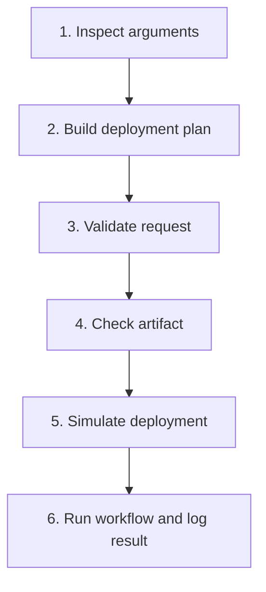

# Bash Arguments Lab — Real DevOps Deployment Flow

## Six Connected Tasks: Zero to Hero

## Lab type

Student assignment — solutions are not included.

## Objective

Build a small, safe DevOps deployment workflow using Bash script arguments. Every task adds one practical skill, and the final task connects the scripts into a simple deployment pipeline.

This lab uses a local directory as a simulated server. It does not deploy to a real production system.

## Skills practised

- `$0`, `$1`, `$2`, `$3`, and `$4`
- `$#`, `"$@"`, and `"$*"`
- Variables and quoted expansions
- `if`, `elif`, and `else`
- Numeric and string conditions
- File and directory tests
- Exit statuses
- Command substitution with `date`
- Standard output and error
- Output redirection
- Passing arguments from one script to another

## Beginner boundaries

Use only concepts already introduced in class:

- Shebang and comments
- `echo`
- Variables
- Arguments
- Basic commands
- `if`, `elif`, and `else`
- `&&` and `||`
- Redirection

Do not use:

- Functions
- Loops
- Arrays
- `case`
- `getopts`
- Remote servers
- `sudo`

---

## DevOps scenario

Your team receives a deployment request containing four values:

```text
Application name → Environment → Version → Artifact file
```

Example request:

```bash
inventory-api dev v1.0.0 artifacts/inventory-api.txt
```

You will build scripts that inspect, organize, validate, check, deploy, and record this request.



---

## Lab directory

Create the following workspace:

```bash
mkdir -p bash-arguments-devops-lab/artifacts
mkdir -p bash-arguments-devops-lab/lab-server
mkdir -p bash-arguments-devops-lab/logs
cd bash-arguments-devops-lab
```

Create a safe sample deployment artifact:

```bash
echo "Inventory API version 1.0.0" > artifacts/inventory-api.txt
```

Confirm the structure:

```bash
find . -maxdepth 2 -type d
find . -maxdepth 2 -type f
```

Expected starting structure:

```text
bash-arguments-devops-lab/
├── artifacts/
│   └── inventory-api.txt
├── lab-server/
└── logs/
```

Your scripts will be created in `bash-arguments-devops-lab/`.

---

# Task 1 — Inspect the deployment arguments

## DevOps purpose

Before using an automation script, an engineer confirms exactly what information the script received.

## Create

```text
01-argument-inspector.sh
```

## Requirements

The script must display:

1. Script name using `$0`.
2. Application name using `$1`.
3. Environment using `$2`.
4. Version using `$3`.
5. Artifact path using `$4`.
6. Total number of arguments using `$#`.
7. All arguments using `$@`.
8. All arguments using `$*`.

Use labelled output so every value is easy to understand.

## Test command

```bash
chmod u+x 01-argument-inspector.sh
./01-argument-inspector.sh inventory-api dev v1.0.0 artifacts/inventory-api.txt
```

## Expected important values

```text
Application: inventory-api
Environment: dev
Version: v1.0.0
Artifact: artifacts/inventory-api.txt
Argument count: 4
```

## Additional test

Pass an application name containing a space:

```bash
./01-argument-inspector.sh "inventory api" dev v1.0.0 artifacts/inventory-api.txt
```

Confirm that `$#` is still `4`.

## Verification

```bash
bash -n 01-argument-inspector.sh
echo "$?"
```

The syntax check should produce no output, and the exit status should be `0`.

---

# Task 2 — Convert arguments into a deployment plan

## DevOps purpose

Descriptive variables make automation scripts easier to read and maintain than repeated positional parameters.

## Create

```text
02-deployment-plan.sh
```

## Requirements

Copy the positional arguments into these variables:

```text
application ← first argument
environment ← second argument
version     ← third argument
artifact    ← fourth argument
```

Display a deployment plan containing:

- Application name
- Target environment
- Release version
- Artifact path
- Current user
- Current hostname
- Current date and time
- Simulated destination: `lab-server/environment/application`

Use `$(date)` for the date and time.

Do not perform a deployment in this task.

## Test command

```bash
chmod u+x 02-deployment-plan.sh
./02-deployment-plan.sh inventory-api dev v1.0.0 artifacts/inventory-api.txt
```

## Expected destination

```text
lab-server/dev/inventory-api
```

## Verification questions

1. Which argument is stored in `application`?
2. Why should variables such as `"$application"` be quoted?
3. Does this task change anything inside `lab-server/`?

---

# Task 3 — Validate the deployment request

## DevOps purpose

A deployment must stop when required information is missing or the target environment is not approved.

## Create

```text
03-validate-request.sh
```

## Requirements

The script must:

1. Check that exactly four arguments were supplied.
2. If the argument count is not four, display an error and a usage example.
3. Accept only these environments:
   - `dev`
   - `test`
   - `prod`
4. Display an approval message for a valid environment.
5. Display an error for any other environment.
6. Exit successfully for a valid request.
7. Exit unsuccessfully for an invalid request.

Use `$#` for the argument count and `$2` for the environment.

Suggested usage message:

```text
Usage: ./03-validate-request.sh APPLICATION ENVIRONMENT VERSION ARTIFACT
```

## Required tests

### No arguments

```bash
./03-validate-request.sh
echo "$?"
```

### Too few arguments

```bash
./03-validate-request.sh inventory-api dev
echo "$?"
```

### Invalid environment

```bash
./03-validate-request.sh inventory-api school v1.0.0 artifacts/inventory-api.txt
echo "$?"
```

### Valid environment

```bash
./03-validate-request.sh inventory-api dev v1.0.0 artifacts/inventory-api.txt
echo "$?"
```

## Expected result

Only the final command should return exit status `0`.

---

# Task 4 — Perform an artifact preflight check

## DevOps purpose

Before deployment, an engineer verifies that the release artifact exists, is a regular file, is readable, and is not empty.

## Create

```text
04-artifact-preflight.sh
```

## Requirements

The script must receive the artifact path as its first argument:

```bash
./04-artifact-preflight.sh ARTIFACT
```

The script must check:

1. Exactly one argument was supplied.
2. The artifact exists as a regular file using `-f`.
3. The artifact is readable using `-r`.
4. The artifact is not empty using `-s`.
5. A clear success message is displayed when all checks pass.
6. A clear error message is displayed when a check fails.
7. The result produces an appropriate exit status.

Do not create, edit, copy, or delete the artifact in this task.

## Required tests

### Valid artifact

```bash
./04-artifact-preflight.sh artifacts/inventory-api.txt
echo "$?"
```

### Missing artifact

```bash
./04-artifact-preflight.sh artifacts/missing.txt
echo "$?"
```

### Empty artifact

Create a temporary empty file:

```bash
touch artifacts/empty.txt
```

Test it:

```bash
./04-artifact-preflight.sh artifacts/empty.txt
echo "$?"
```

## Expected result

- The real artifact should pass.
- The missing artifact should fail.
- The empty artifact should fail.

---

# Task 5 — Perform a safe local deployment

## DevOps purpose

The deployment step places a verified release artifact into the correct application and environment directory.

## Create

```text
05-local-deploy.sh
```

## Requirements

The script receives four arguments:

```text
$1 = Application
$2 = Environment
$3 = Version
$4 = Artifact path
```

The script must:

1. Confirm that exactly four arguments were supplied.
2. Store all four arguments in descriptive variables.
3. Confirm that the artifact is a non-empty regular file.
4. Build this destination path:

   ```text
   lab-server/ENVIRONMENT/APPLICATION/VERSION
   ```

5. Create the destination directory with `mkdir -p`.
6. Copy the artifact into the destination with `cp`.
7. Display the complete destination path.
8. Display a success message only when the copy succeeds.
9. Display a failure message when validation, directory creation, or copying fails.

Do not use `sudo`. Do not write outside the lab directory.

## Test command

```bash
chmod u+x 05-local-deploy.sh
./05-local-deploy.sh inventory-api dev v1.0.0 artifacts/inventory-api.txt
```

## Verify the deployment

```bash
find lab-server -type f
cat lab-server/dev/inventory-api/v1.0.0/inventory-api.txt
```

## Expected deployed file

```text
lab-server/dev/inventory-api/v1.0.0/inventory-api.txt
```

## Failure test

```bash
./05-local-deploy.sh inventory-api dev v1.0.1 artifacts/missing.txt
echo "$?"
```

The script must not report a successful deployment.

---

# Task 6 — Build the DevOps workflow runner and audit log

## DevOps purpose

A wrapper script gives engineers one entry point, forwards the original arguments, and records the final result for troubleshooting and auditing.

## Create

```text
06-deployment-runner.sh
```

## Requirements

The runner receives the same four arguments:

```bash
./06-deployment-runner.sh APPLICATION ENVIRONMENT VERSION ARTIFACT
```

The script must:

1. Check that exactly four arguments were supplied.
2. Display a usage message when the count is incorrect.
3. Send all received arguments to `03-validate-request.sh` using `"$@"`.
4. Stop and report failure if request validation fails.
5. Send the artifact argument to `04-artifact-preflight.sh`.
6. Stop and report failure if the preflight check fails.
7. Send all original arguments to `05-local-deploy.sh` using `"$@"`.
8. Create `logs/deployment.log` when it does not exist.
9. Append one success or failure record to the log.
10. Include the following fields in each log record:
    - Date and time
    - Current user
    - Application
    - Environment
    - Version
    - Artifact
    - Final status
11. Display the final deployment result.
12. Return exit status `0` only when the complete workflow succeeds.

Use `>>` so each deployment adds a new record without overwriting earlier records.

Do not use functions or loops.

## Successful workflow test

```bash
chmod u+x 03-validate-request.sh
chmod u+x 04-artifact-preflight.sh
chmod u+x 05-local-deploy.sh
chmod u+x 06-deployment-runner.sh

./06-deployment-runner.sh inventory-api dev v1.0.0 artifacts/inventory-api.txt
echo "$?"
```

## Failure tests

### Invalid environment

```bash
./06-deployment-runner.sh inventory-api classroom v1.0.0 artifacts/inventory-api.txt
echo "$?"
```

### Missing artifact

```bash
./06-deployment-runner.sh inventory-api test v1.0.1 artifacts/missing.txt
echo "$?"
```

### Missing argument

```bash
./06-deployment-runner.sh inventory-api dev v1.0.0
echo "$?"
```

## Verify the audit log

```bash
cat logs/deployment.log
```

The log should contain a separate record for each completed attempt that reaches the logging stage.

## Why `"$@"` matters

If the runner receives:

```bash
./06-deployment-runner.sh "inventory api" dev v1.0.0 artifacts/inventory-api.txt
```

Forwarding with:

```bash
./03-validate-request.sh "$@"
```

preserves `inventory api` as one argument.

---

# Final verification

## 1. Check all script syntax

```bash
bash -n 01-argument-inspector.sh
bash -n 02-deployment-plan.sh
bash -n 03-validate-request.sh
bash -n 04-artifact-preflight.sh
bash -n 05-local-deploy.sh
bash -n 06-deployment-runner.sh
```

No output means Bash found no syntax errors.

## 2. Confirm executable permissions

```bash
ls -l *.sh
```

## 3. Confirm the deployed artifact

```bash
find lab-server -type f
```

## 4. Confirm the audit history

```bash
cat logs/deployment.log
```

## 5. Confirm exit statuses

Run one successful workflow and one failing workflow. Print `$?` immediately after each one.

---

# Required deliverables

Submit this structure:

```text
bash-arguments-devops-lab/
├── README.md
├── 01-argument-inspector.sh
├── 02-deployment-plan.sh
├── 03-validate-request.sh
├── 04-artifact-preflight.sh
├── 05-local-deploy.sh
├── 06-deployment-runner.sh
├── artifacts/
│   └── inventory-api.txt
├── lab-server/
│   └── dev/
│       └── inventory-api/
│           └── v1.0.0/
│               └── inventory-api.txt
└── logs/
    └── deployment.log
```

The `README.md` must contain:

- Lab objective
- Commands used
- One successful test
- One failed test
- Explanation of `$#`
- Explanation of `"$@"`
- Explanation of why arguments are quoted
- Final learning summary

---

# Evaluation checklist

| Requirement | Marks |
|---|---:|
| Task 1 correctly displays positional and special arguments | 10 |
| Task 2 creates a clear deployment plan | 10 |
| Task 3 validates count and environment | 15 |
| Task 4 correctly checks the artifact | 15 |
| Task 5 safely deploys to the local lab server | 20 |
| Task 6 connects scripts and creates an audit log | 20 |
| Syntax, permissions, comments, quoting, and README | 10 |
| **Total** | **100** |

---

# Interview review questions

1. What does `$0` contain?
2. What is the difference between `$1` and `$#`?
3. Why is `"$@"` recommended when forwarding arguments?
4. What is the difference between `"$@"` and `"$*"`?
5. How do you access the tenth argument?
6. Why should argument variables be quoted?
7. How can a script report invalid usage?
8. Why should deployment input be validated before copying an artifact?
9. What does exit status `0` mean?
10. Why should a deployment log use `>>` instead of `>`?

---

# Completion standard

The lab is complete when:

- All six scripts pass `bash -n`.
- Valid input completes the simulated deployment.
- Invalid input does not create a false success message.
- The artifact is copied only inside `lab-server/`.
- `deployment.log` contains clear audit information.
- The workflow runner preserves all original arguments with `"$@"`.

