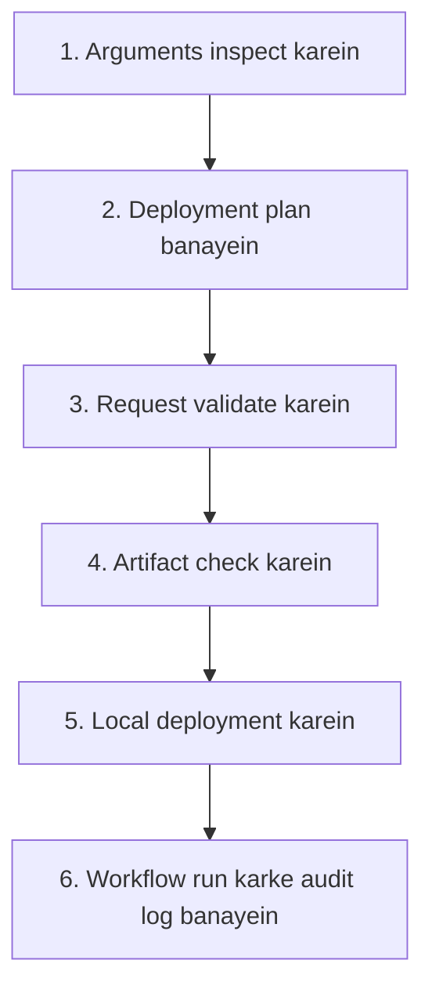

# Bash Arguments Lab — Real DevOps Deployment Flow

## Roman Urdu Guide

## Taaruf

Yeh beginner-friendly hands-on lab Bash positional arguments ko aik safe aur simulated DevOps deployment workflow ke zariye sikhati hai.

Students step by step chhay connected scripts banayen ge. Yeh scripts deployment input ko inspect karen ge, deployment plan banayen ge, request validate karen ge, artifact check karen ge, local deployment perform karen ge, aur final result ko audit log mein record karen ge.

Is lab mein kisi real server ya production environment ko modify nahin kiya jata.

---

## Learning objectives

Is lab ko complete karne ke baad students:

- `$0`, `$1`, `$2`, `$3`, aur `$4` use kar saken ge.
- `$#` se arguments count kar saken ge.
- `"$@"` aur `"$*"` ka farq samajh saken ge.
- Arguments aur variables ko quote karke spaces preserve kar saken ge.
- Positional arguments ko descriptive variables mein convert kar saken ge.
- Argument count aur deployment environment validate kar saken ge.
- Bash conditions se files check kar saken ge.
- Workflow mein command exit statuses use kar saken ge.
- Aik script se doosri script ko arguments pass kar saken ge.
- Local directory mein safe deployment simulate kar saken ge.
- Deployment results ko audit log mein append kar saken ge.

---

## DevOps scenario

Simulated deployment request mein chaar values hongi:

```text
Application → Environment → Version → Artifact
```

Primary example:

```bash
inventory-api dev v1.0.0 artifacts/inventory-api.txt
```

Workflow is request ko chhay stages mein process karega:



---

## Package ke andar mojood files

```text
Arguments-lab/
├── README.md
├── Bash-Arguments-Lab.md
├── Shell-Scripting-Arguments-Beginner-Study-Notes.md
└── bash-arguments-devops-lab-data/
    ├── README.md
    ├── artifacts/
    │   ├── customer-portal.txt
    │   ├── inventory-api.txt
    │   └── payments-api.txt
    ├── lab-server/
    │   └── README.md
    ├── logs/
    │   └── README.md
    └── test-data/
        ├── argument-scenarios.csv
        └── deployment-commands.txt
```

### Main documents

| File | Maqsad |
|---|---|
| `README.md` | Package ka overview aur quick-start instructions |
| `Bash-Arguments-Lab.md` | Complete six-task student assignment |
| `Shell-Scripting-Arguments-Beginner-Study-Notes.md` | Arguments ki detailed lesson aur reference |
| `bash-arguments-devops-lab-data/README.md` | Starter data aur test commands ki instructions |

---

## Lab ke chhay tasks

| Task | Script jo banani hai | DevOps maqsad |
|---:|---|---|
| 1 | `01-argument-inspector.sh` | Diye gaye deployment arguments ko inspect karna |
| 2 | `02-deployment-plan.sh` | Arguments ko readable deployment plan mein convert karna |
| 3 | `03-validate-request.sh` | Argument count aur target environment validate karna |
| 4 | `04-artifact-preflight.sh` | Check karna ke artifact usable hai ya nahin |
| 5 | `05-local-deploy.sh` | Artifact ko simulated local server mein copy karna |
| 6 | `06-deployment-runner.sh` | Complete workflow connect karna aur audit log likhna |

---

## Prerequisites

Lab shuru karne se pehle yeh cheezen honi chahiye:

- Linux, Ubuntu, WSL, ya Linux virtual machine
- Bash shell
- Vim ya Nano jaisa text editor
- Commands, permissions, variables, arguments, aur conditions ki basic understanding

Bash verify karein:

```bash
bash --version
```

---

## Quick start

### 1. Package extract karein

```bash
unzip Arguments-lab.zip
cd Arguments-lab
```

### 2. Study notes parhein

```bash
less Shell-Scripting-Arguments-Beginner-Study-Notes.md
```

### 3. Assignment open karein

```bash
less Bash-Arguments-Lab.md
```

### 4. Working lab directory tayyar karein

Provided starter data ko aik separate working directory mein copy karein:

```bash
cp -r bash-arguments-devops-lab-data bash-arguments-devops-lab
cd bash-arguments-devops-lab
```

Assignment complete karte hue isi directory mein chhay scripts banayein.

### 5. Supplied artifacts inspect karein

```bash
ls -lh artifacts/
cat artifacts/inventory-api.txt
```

### 6. Supplied scenarios display karein

```bash
column -s, -t test-data/argument-scenarios.csv
```

Agar `column` command available nahin hai to:

```bash
cat test-data/argument-scenarios.csv
```

---

## Primary test values

```text
Application: inventory-api
Environment: dev
Version: v1.0.0
Artifact: artifacts/inventory-api.txt
```

Complete argument set:

```bash
inventory-api dev v1.0.0 artifacts/inventory-api.txt
```

Script execution ki misal:

```bash
./01-argument-inspector.sh inventory-api dev v1.0.0 artifacts/inventory-api.txt
```

---

## Supplied artifacts

| Artifact | Example use |
|---|---|
| `inventory-api.txt` | Primary development deployment |
| `payments-api.txt` | Testing environment deployment |
| `customer-portal.txt` | Production aur quoted-name practice |

Quoted application name ki misal:

```bash
./01-argument-inspector.sh "customer portal" test v2.1.0 artifacts/customer-portal.txt
```

Kyunke `customer portal` quotation marks mein hai, is liye Bash isay aik argument samjhega.

---

## Expected final working structure

```text
bash-arguments-devops-lab/
├── 01-argument-inspector.sh
├── 02-deployment-plan.sh
├── 03-validate-request.sh
├── 04-artifact-preflight.sh
├── 05-local-deploy.sh
├── 06-deployment-runner.sh
├── artifacts/
│   ├── customer-portal.txt
│   ├── inventory-api.txt
│   └── payments-api.txt
├── lab-server/
├── logs/
└── test-data/
    ├── argument-scenarios.csv
    └── deployment-commands.txt
```

Successful primary deployment ke baad generated artifact is path par hona chahiye:

```text
lab-server/dev/inventory-api/v1.0.0/inventory-api.txt
```

Workflow audit history is path par honi chahiye:

```text
logs/deployment.log
```

---

## Syntax aur permission checks

Scripts ko execute kiye baghair syntax check karein:

```bash
bash -n 01-argument-inspector.sh
bash -n 02-deployment-plan.sh
bash -n 03-validate-request.sh
bash -n 04-artifact-preflight.sh
bash -n 05-local-deploy.sh
bash -n 06-deployment-runner.sh
```

Koi output na milna aam tor par is baat ka matlab hai ke Bash ko syntax error nahin mila.

Execute permission add karein:

```bash
chmod u+x *.sh
```

Permissions verify karein:

```bash
ls -l *.sh
```

---

## Complete workflow test

Tamam chhay scripts banane ke baad yeh command run karein:

```bash
./06-deployment-runner.sh inventory-api dev v1.0.0 artifacts/inventory-api.txt
echo "$?"
```

Successful workflow ko:

1. Tamam chaar arguments validate karne chahiye.
2. `dev` environment approve karna chahiye.
3. Confirm karna chahiye ke artifact readable, non-empty regular file hai.
4. Local destination create karni chahiye.
5. Artifact copy karna chahiye.
6. Deployment log mein success record append karna chahiye.
7. Exit status `0` return karna chahiye.

Result verify karein:

```bash
find lab-server -type f
cat lab-server/dev/inventory-api/v1.0.0/inventory-api.txt
cat logs/deployment.log
```

---

## Failure tests

### Invalid environment

```bash
./06-deployment-runner.sh inventory-api classroom v1.0.0 artifacts/inventory-api.txt
echo "$?"
```

### Missing artifact

```bash
./06-deployment-runner.sh inventory-api test v1.0.1 artifacts/missing.txt
echo "$?"
```

### Missing argument

```bash
./06-deployment-runner.sh inventory-api dev v1.0.0
echo "$?"
```

### Empty artifact

```bash
touch artifacts/empty.txt
./06-deployment-runner.sh inventory-api dev v1.0.1 artifacts/empty.txt
echo "$?"
```

Failed workflows ko non-zero exit status return karna chahiye aur ghalat success message display nahin karna chahiye.

---

## Important argument reference

| Parameter | Matlab |
|---|---|
| `$0` | Script ka naam ya path |
| `$1` | Pehla argument |
| `$2` | Doosra argument |
| `$3` | Teesra argument |
| `$4` | Chautha argument |
| `$#` | Arguments ki tadaad |
| `"$@"` | Tamam arguments alag alag preserve hote hain — recommended |
| `"$*"` | Tamam arguments aik string mein combine hote hain |

---

## `"$@"` aur `"$*"` ka farq

Agar command yeh ho:

```bash
./script.sh "customer portal" dev v1.0.0
```

To:

```text
"$@" → "customer portal" "dev" "v1.0.0"
"$*" → "customer portal dev v1.0.0"
```

`"$@"` original argument boundaries ko preserve karta hai. Isi liye doosri script ko arguments forward karte waqt yeh recommended hai:

```bash
./another-script.sh "$@"
```

---

## Beginner boundaries

Is assignment mein jaan boojh kar yeh advanced topics use nahin kiye gaye:

- Functions
- Loops
- Arrays
- `case`
- `getopts`
- `sudo`
- Remote servers
- Production changes

Maqsad yeh hai ke advanced Bash features shuru karne se pehle students arguments aur basic conditional workflow ko achhi tarah samajh lein.

---

## Safety rules

- Sirf supplied fictional artifacts use karein.
- Scripts ko lab directory ke andar run karein.
- Files ko sirf `lab-server/` ke andar copy karein.
- Is lab mein `sudo` use na karein.
- Scripts ko production directories ya real servers ki taraf point na karein.

---

## Completion checklist

- [ ] Arguments study notes parh liye.
- [ ] Tamam chhay scripts complete kar li.
- [ ] Har script ka `bash -n` test pass ho gaya.
- [ ] Execute permission add kar di.
- [ ] Quoted application name test kar liya.
- [ ] Aik successful deployment complete kar li.
- [ ] Kam az kam teen failure tests complete kar liye.
- [ ] Deployed artifact verify kar liya.
- [ ] Audit log verify kar liya.
- [ ] `$#`, `"$@"`, aur `"$*"` ko apne alfaaz mein explain kar sakte hain.

---

## Final learning outcome

Is lab ko complete karke students basic positional arguments display karne se aage barh kar aik chhota lekin realistic deployment workflow banayen ge. Yeh workflow input validate karega, artifacts check karega, failures handle karega, argument boundaries preserve karega, aur results ko safely record karega.
