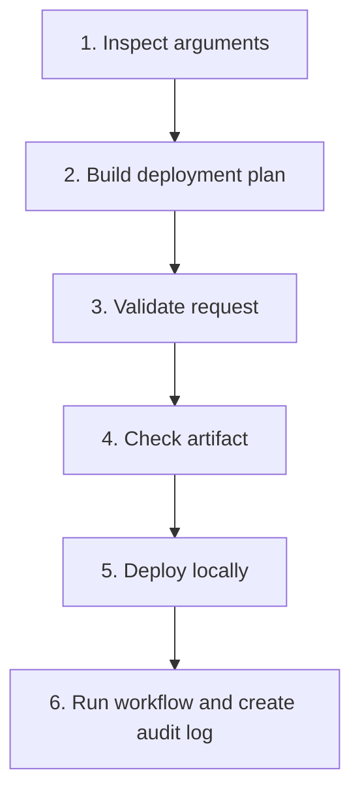

# Bash Arguments Lab — Real DevOps Deployment Flow

## Overview

This beginner-friendly hands-on lab teaches Bash positional arguments through a safe, simulated DevOps deployment workflow.

Students progressively build six connected scripts that inspect deployment input, create a deployment plan, validate the request, check an artifact, perform a local deployment, and record the final result in an audit log.

No real server or production environment is modified.

---

## Learning objectives

After completing this lab, students should be able to:

- Use `$0`, `$1`, `$2`, `$3`, and `$4`.
- Count arguments with `$#`.
- Explain the difference between `"$@"` and `"$*"`.
- Preserve spaces by quoting arguments and variables.
- Convert positional arguments into descriptive variables.
- Validate argument count and deployment environments.
- Check files with Bash conditions.
- Use command exit statuses in a workflow.
- Pass arguments from one script to another.
- Simulate a deployment safely in a local directory.
- Append deployment results to an audit log.

---

## DevOps scenario

The simulated deployment request contains four values:

```text
Application → Environment → Version → Artifact
```

Primary example:

```bash
inventory-api dev v1.0.0 artifacts/inventory-api.txt
```

The workflow processes the request in six stages:



---

## Package contents

```text
Arguments-lab/
├── README.md
├── Bash-Arguments-Lab.md
├── Shell-Scripting-Arguments-Beginner-Study-Notes.md
└── bash-arguments-devops-lab-data/
    ├── README.md
    ├── artifacts/
    │   ├── customer-portal.txt
    │   ├── inventory-api.txt
    │   └── payments-api.txt
    ├── lab-server/
    │   └── README.md
    ├── logs/
    │   └── README.md
    └── test-data/
        ├── argument-scenarios.csv
        └── deployment-commands.txt
```

### Main documents

| File | Purpose |
|---|---|
| `README.md` | Package overview and quick-start instructions |
| `Bash-Arguments-Lab.md` | Complete six-task student assignment |
| `Shell-Scripting-Arguments-Beginner-Study-Notes.md` | Detailed arguments lesson and reference |
| `bash-arguments-devops-lab-data/README.md` | Starter-data instructions and test commands |

---

## Six lab tasks

| Task | Script to create | DevOps purpose |
|---:|---|---|
| 1 | `01-argument-inspector.sh` | Inspect the supplied deployment arguments |
| 2 | `02-deployment-plan.sh` | Convert arguments into a readable deployment plan |
| 3 | `03-validate-request.sh` | Validate argument count and target environment |
| 4 | `04-artifact-preflight.sh` | Check whether the artifact is usable |
| 5 | `05-local-deploy.sh` | Copy the artifact to a simulated local server |
| 6 | `06-deployment-runner.sh` | Connect the workflow and write an audit log |

---

## Prerequisites

- Linux, Ubuntu, WSL, or a Linux virtual machine
- Bash shell
- A text editor such as Vim or Nano
- Basic understanding of commands, permissions, variables, arguments, and conditions

Confirm Bash:

```bash
bash --version
```

---

## Quick start

### 1. Extract the package

```bash
unzip Arguments-lab.zip
cd Arguments-lab
```

### 2. Read the study notes

```bash
less Shell-Scripting-Arguments-Beginner-Study-Notes.md
```

### 3. Open the assignment

```bash
less Bash-Arguments-Lab.md
```

### 4. Prepare the working lab directory

Copy the provided starter data into a separate working directory:

```bash
cp -r bash-arguments-devops-lab-data bash-arguments-devops-lab
cd bash-arguments-devops-lab
```

Create the six scripts in this directory as you complete the assignment.

### 5. Inspect the supplied artifacts

```bash
ls -lh artifacts/
cat artifacts/inventory-api.txt
```

### 6. Display the supplied scenarios

```bash
column -s, -t test-data/argument-scenarios.csv
```

If `column` is unavailable:

```bash
cat test-data/argument-scenarios.csv
```

---

## Primary test values

```text
Application: inventory-api
Environment: dev
Version: v1.0.0
Artifact: artifacts/inventory-api.txt
```

Complete argument set:

```bash
inventory-api dev v1.0.0 artifacts/inventory-api.txt
```

Example script execution:

```bash
./01-argument-inspector.sh inventory-api dev v1.0.0 artifacts/inventory-api.txt
```

---

## Supplied artifacts

| Artifact | Example use |
|---|---|
| `inventory-api.txt` | Primary development deployment |
| `payments-api.txt` | Testing-environment deployment |
| `customer-portal.txt` | Production and quoted-name practice |

Example using a quoted application name:

```bash
./01-argument-inspector.sh "customer portal" test v2.1.0 artifacts/customer-portal.txt
```

Because `customer portal` is quoted, Bash treats it as one argument.

---

## Expected final working structure

```text
bash-arguments-devops-lab/
├── 01-argument-inspector.sh
├── 02-deployment-plan.sh
├── 03-validate-request.sh
├── 04-artifact-preflight.sh
├── 05-local-deploy.sh
├── 06-deployment-runner.sh
├── artifacts/
│   ├── customer-portal.txt
│   ├── inventory-api.txt
│   └── payments-api.txt
├── lab-server/
├── logs/
└── test-data/
    ├── argument-scenarios.csv
    └── deployment-commands.txt
```

After a successful primary deployment, the generated artifact should appear at:

```text
lab-server/dev/inventory-api/v1.0.0/inventory-api.txt
```

The workflow audit history should appear at:

```text
logs/deployment.log
```

---

## Syntax and permission checks

Check all scripts without executing them:

```bash
bash -n 01-argument-inspector.sh
bash -n 02-deployment-plan.sh
bash -n 03-validate-request.sh
bash -n 04-artifact-preflight.sh
bash -n 05-local-deploy.sh
bash -n 06-deployment-runner.sh
```

No output normally means Bash found no syntax errors.

Add execute permission:

```bash
chmod u+x *.sh
```

Verify permissions:

```bash
ls -l *.sh
```

---

## Complete workflow test

After creating all six scripts, run:

```bash
./06-deployment-runner.sh inventory-api dev v1.0.0 artifacts/inventory-api.txt
echo "$?"
```

A successful workflow should:

1. Validate all four arguments.
2. Approve the `dev` environment.
3. Confirm that the artifact is a readable, non-empty regular file.
4. Create the local destination.
5. Copy the artifact.
6. Append a success record to the deployment log.
7. Return exit status `0`.

Verify the result:

```bash
find lab-server -type f
cat lab-server/dev/inventory-api/v1.0.0/inventory-api.txt
cat logs/deployment.log
```

---

## Failure tests

### Invalid environment

```bash
./06-deployment-runner.sh inventory-api classroom v1.0.0 artifacts/inventory-api.txt
echo "$?"
```

### Missing artifact

```bash
./06-deployment-runner.sh inventory-api test v1.0.1 artifacts/missing.txt
echo "$?"
```

### Missing argument

```bash
./06-deployment-runner.sh inventory-api dev v1.0.0
echo "$?"
```

### Empty artifact

```bash
touch artifacts/empty.txt
./06-deployment-runner.sh inventory-api dev v1.0.1 artifacts/empty.txt
echo "$?"
```

Failed workflows should return a non-zero status and must not display a false success message.

---

## Key argument reference

| Parameter | Meaning |
|---|---|
| `$0` | Script name or path |
| `$1` | First argument |
| `$2` | Second argument |
| `$3` | Third argument |
| `$4` | Fourth argument |
| `$#` | Number of arguments |
| `"$@"` | All arguments preserved separately — recommended |
| `"$*"` | All arguments combined into one string |

---

## Beginner boundaries

This assignment intentionally avoids:

- Functions
- Loops
- Arrays
- `case`
- `getopts`
- `sudo`
- Remote servers
- Production changes

The goal is to master arguments and basic conditional workflow before introducing more advanced Bash features.

---

## Safety

- Use only the supplied fictional artifacts.
- Run the scripts inside the lab directory.
- Copy files only into `lab-server/`.
- Do not use `sudo` for this lab.
- Do not point the scripts at production directories or real servers.

---

## Completion checklist

- [ ] Read the arguments study notes.
- [ ] Complete all six scripts.
- [ ] Pass `bash -n` for every script.
- [ ] Add executable permission.
- [ ] Test a quoted application name.
- [ ] Complete one successful deployment.
- [ ] Complete at least three failure tests.
- [ ] Verify the deployed artifact.
- [ ] Verify the audit log.
- [ ] Explain `$#`, `"$@"`, and `"$*"` in your own words.

---

## Final learning outcome

By completing this lab, students move from displaying basic positional arguments to building a small, realistic deployment workflow that validates input, checks artifacts, handles failures, preserves argument boundaries, and records results safely.

