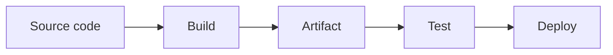

# DevOps Artifacts — Beginner Study Notes

## Learning objectives

After completing this lesson, students should be able to:

- Define an artifact in simple words.
- Explain the difference between source code and an artifact.
- Recognize common artifact formats.
- Describe where artifacts appear in a DevOps workflow.
- Explain why artifacts are versioned.
- Validate an artifact with Bash conditions.
- Identify the artifacts used in the Arguments and Conditionals labs.

---

## 1. What is an artifact?

An **artifact** is a file or package produced from application source code and prepared for testing, storing, or deployment.

In simple words:

> An artifact is the finished package that DevOps engineers move from development to testing or production.

Examples:

```text
inventory-api-v1.0.0.tar.gz
customer-portal-v2.1.0.zip
payments-api-v3.0.0.jar
```

---

## 2. Real-life bakery example

Think about a bakery:

| Bakery | Software development |
|---|---|
| Ingredients | Source code |
| Baking process | Build process |
| Finished cake | Artifact |
| Checking the cake | Testing |
| Delivering it to a shop | Deployment |

Developers work with source code, while a deployment system usually deploys the finished artifact.

---

## 3. Artifact flow in DevOps



Example:

```text
Source code
    ↓
Build process
    ↓
inventory-api-v1.0.0.tar.gz
    ↓
Testing
    ↓
Deployment
```

The important idea is that the same artifact should move through testing and deployment. Engineers should not rebuild a different package for each environment.

---

## 4. Common artifact types

| Technology | Artifact example |
|---|---|
| Bash lab | `.txt`, `.tar.gz`, or `.zip` |
| Java | `.jar` or `.war` |
| JavaScript | `dist/` package or `.zip` |
| Python | `.whl` package |
| Linux | `.deb` or `.rpm` |
| Containers | Docker image |
| C/C++ | Compiled binary |
| Website | Packaged HTML, CSS, and JavaScript files |

An artifact does not always have to be compressed. It can be any finished, versioned output intended for testing or deployment.

---

## 5. Artifact in the Arguments Lab

The primary artifact is:

```text
artifacts/inventory-api.txt
```

It represents a simple application release:

```text
Application: Inventory API
Version: v1.0.0
Owner: Platform Engineering
Health endpoint: /health
```

The deployment script receives the artifact path as an argument:

```bash
./06-deployment-runner.sh inventory-api dev v1.0.0 artifacts/inventory-api.txt
```

The workflow validates and copies it to:

```text
lab-server/dev/inventory-api/v1.0.0/inventory-api.txt
```

The Arguments Lab focuses on:

- Passing the artifact path as `$4`.
- Storing it in a variable.
- Quoting the variable.
- Checking the file.
- Copying it to the correct destination.

---

## 6. Artifact in the Conditionals Lab

The primary artifact is:

```text
artifacts/inventory-api-v1.0.0.tar.gz
```

It is a compressed application package containing:

```text
inventory-api-v1.0.0/
├── VERSION
├── application.txt
└── config.env
```

Display the package contents without extracting it:

```bash
tar -tzf artifacts/inventory-api-v1.0.0.tar.gz
```

The Conditionals Lab checks whether the artifact:

- Exists as a regular file.
- Is readable.
- Is not empty.
- Ends with `.tar.gz`.
- Is approved for deployment only after every readiness gate passes.

---

## 7. Source code versus artifact

| Source code | Artifact |
|---|---|
| Files developers edit | Packaged deployment output |
| May contain many project files | Contains release-ready files |
| Changes frequently | Created for a specific release |
| Used to build the application | Used to test and deploy the application |
| Example: `source/` | Example: `inventory-api-v1.0.0.tar.gz` |

Example:

```text
source/inventory-api-v1.0.0/
```

is packaged into:

```text
artifacts/inventory-api-v1.0.0.tar.gz
```

---

## 8. Why do DevOps engineers use artifacts?

Artifacts provide:

### Consistency

The same package is tested and deployed.

### Versioning

Every release can have a unique version.

### Portability

The package can move between environments.

### Repeatability

The same version can be deployed again.

### Traceability

Engineers can determine exactly which version was deployed.

### Rollback

A previous artifact can be redeployed when a new release fails.

### Automation

CI/CD pipelines can download, test, scan, and deploy a known package.

---

## 9. Why include a version in the artifact name?

Compare this unclear filename:

```text
inventory-api.tar.gz
```

with these versioned files:

```text
inventory-api-v1.0.0.tar.gz
inventory-api-v1.1.0.tar.gz
inventory-api-v2.0.0.tar.gz
```

Versioned filenames make releases easier to:

- Identify
- Test
- Deploy
- Audit
- Compare
- Roll back

The application name and version should normally be visible in the artifact name or its metadata.

---

## 10. Artifact validation with Bash

Before deployment, a DevOps engineer should validate the artifact.

### Check whether it is a regular file

```bash
[[ -f "$artifact" ]]
```

### Check whether it is readable

```bash
[[ -r "$artifact" ]]
```

### Check whether it is not empty

```bash
[[ -s "$artifact" ]]
```

### Check the expected extension

```bash
[[ "$artifact" == *.tar.gz ]]
```

### Complete beginner example

```bash
#!/bin/bash

artifact="$1"

if [[ -z "$artifact" ]]; then
    echo "Artifact path was not provided."
elif [[ ! -f "$artifact" ]]; then
    echo "Artifact does not exist."
elif [[ ! -r "$artifact" ]]; then
    echo "Artifact is not readable."
elif [[ ! -s "$artifact" ]]; then
    echo "Artifact is empty."
elif [[ "$artifact" != *.tar.gz ]]; then
    echo "Artifact extension is incorrect."
else
    echo "Artifact validation passed."
fi
```

Run it:

```bash
./check_artifact.sh artifacts/inventory-api-v1.0.0.tar.gz
```

---

## 11. Useful artifact commands

### List artifacts

```bash
ls -lh artifacts/
```

### Identify the file type

```bash
file artifacts/inventory-api-v1.0.0.tar.gz
```

### Display a SHA-256 checksum

```bash
sha256sum artifacts/inventory-api-v1.0.0.tar.gz
```

### View the contents of a `.tar.gz` package

```bash
tar -tzf artifacts/inventory-api-v1.0.0.tar.gz
```

### Extract the package

```bash
mkdir -p extracted-artifact
tar -xzf artifacts/inventory-api-v1.0.0.tar.gz -C extracted-artifact
```

### Find deployed artifacts

```bash
find lab-server -type f
```

---

## 12. What is a checksum?

A checksum is a calculated value used to verify that an artifact has not changed or become corrupted.

Create a SHA-256 checksum:

```bash
sha256sum artifacts/inventory-api-v1.0.0.tar.gz
```

Example output:

```text
abc123...  artifacts/inventory-api-v1.0.0.tar.gz
```

If the artifact changes, its checksum also changes.

DevOps pipelines can compare checksums before deployment to confirm artifact integrity.

---

## 13. What is an artifact repository?

An **artifact repository** is a system used to store, organize, secure, and distribute versioned artifacts.

Common examples include:

- JFrog Artifactory
- Sonatype Nexus Repository
- GitHub Packages
- AWS CodeArtifact
- Amazon ECR for container images
- Docker Hub

A typical workflow is:

```text
Developer pushes source code
        ↓
CI pipeline builds an artifact
        ↓
Pipeline tests and scans the artifact
        ↓
Artifact repository stores it
        ↓
Deployment pipeline downloads it
        ↓
The same artifact is deployed
```

---

## 14. Artifact versus other DevOps files

| Item | Purpose |
|---|---|
| Source code | Used to build the application |
| Artifact | Packaged application prepared for deployment |
| Configuration | Controls application behavior |
| Log | Records what happened during execution |
| Deployment script | Automates validation and deployment |
| Checksum | Helps verify artifact integrity |

A deployment log is normally not the application artifact. It is evidence of what happened during the deployment.

---

## 15. Successful and failed artifact examples

### Valid artifact

```text
artifacts/inventory-api-v1.0.0.tar.gz
```

Expected result:

```text
Artifact validation passed.
```

### Missing artifact

```text
artifacts/missing.tar.gz
```

Expected result:

```text
Artifact does not exist.
```

### Empty artifact

Create it:

```bash
touch artifacts/empty.tar.gz
```

Expected result:

```text
Artifact is empty.
```

### Incorrect extension

```text
artifacts/release.txt
```

Expected result in the Conditionals Lab:

```text
Artifact extension is incorrect.
```

---

## 16. Key classroom definitions

### One-line definition

> A DevOps artifact is a versioned, testable, and deployable package created from application source code.

### Very simple definition

> Source code is what developers write; an artifact is what DevOps deploys.

### Interview answer

**Question:** What is an artifact in DevOps?

**Answer:** An artifact is the packaged output of a build process, such as a `.jar`, `.zip`, `.tar.gz`, binary, or container image. It is stored, tested, versioned, and deployed consistently across environments.

---

## 17. Student practice tasks

1. List the files in the `artifacts/` directory.
2. Use `file` to identify the `.tar.gz` artifact.
3. Display the files inside the archive with `tar -tzf`.
4. Extract the artifact into a new directory.
5. Generate its SHA-256 checksum.
6. Create an empty artifact and test `-s` against it.
7. Test a missing artifact with `-f`.
8. Test a `.txt` file against the `*.tar.gz` pattern.
9. Explain the difference between `source/` and `artifacts/`.
10. Explain why the same artifact should be used in testing and production.

---

## 18. Review questions

1. What is an artifact?
2. How is an artifact different from source code?
3. Give three examples of artifact formats.
4. Why should an artifact include a version?
5. What does `-f` check?
6. What does `-r` check?
7. What does `-s` check?
8. What does `*.tar.gz` represent inside `[[ ]]`?
9. Why are checksums useful?
10. What is an artifact repository?
11. Is a deployment log normally the application artifact?
12. Why should the same artifact move through test and production?

---

## Quick summary

```text
Source code → Build → Artifact → Test → Store → Deploy
```

Remember:

- Source code is edited by developers.
- A build process creates an artifact.
- The artifact should have a clear version.
- The artifact must be validated before deployment.
- The same artifact should move through environments.
- A repository stores and distributes artifacts.
- Logs describe what happened; they are not normally the application artifact.

