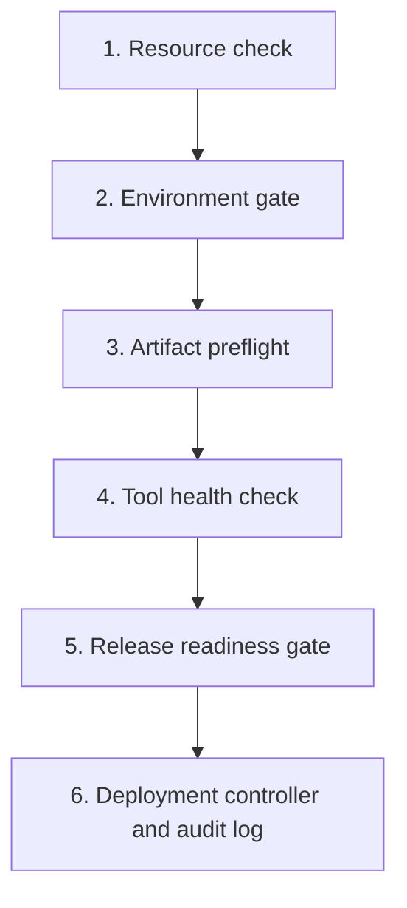

# Bash Conditionals Lab — Real DevOps Release Flow

## Six Connected Tasks: Zero to Hero

## Lab type

Student assignment — solutions are not included.

## Objective

Build a safe local release workflow that makes decisions using Bash conditionals. Each task represents a check commonly performed before a DevOps engineer approves and deploys an application release.

The final workflow will answer one important question:

```text
Is this release safe and approved for deployment?
```

This lab uses local directories as simulated infrastructure. It does not modify a real server or production environment.

## Skills practised

- `if`, `elif`, and `else`
- Traditional `[ condition ]`
- Modern Bash `[[ condition ]]`
- Numeric comparisons
- String comparisons
- Empty-value checks
- Wildcard pattern matching
- File and directory tests
- Command exit statuses
- `&&`, `||`, and `!`
- Nested conditionals
- Script arguments
- Standard output and standard error
- Exit statuses
- Audit logging

## Beginner boundaries

Use only:

- Shebang and comments
- `echo`
- Variables and arguments
- `if`, `elif`, and `else`
- `[ ]` and `[[ ]]`
- `&&`, `||`, and `!`
- Basic Linux commands
- Output redirection
- `exit`

Do not use:

- Functions
- Loops
- Arrays
- `case`
- `getopts`
- Remote servers
- `sudo`
- Production resources

---

## DevOps scenario

Your team wants to deploy `inventory-api`. Before deployment, the workflow must check:

1. Resource usage is safe.
2. The target environment is approved.
3. A production change ticket is present when required.
4. The release artifact is valid.
5. Required deployment tools are installed.
6. Every gate passes before the artifact is copied.



---

## Lab setup

Create the workspace:

```bash
mkdir -p bash-conditionals-devops-lab/source
mkdir -p bash-conditionals-devops-lab/artifacts
mkdir -p bash-conditionals-devops-lab/lab-server
mkdir -p bash-conditionals-devops-lab/logs
cd bash-conditionals-devops-lab
```

Create a sample application file:

```bash
echo "Inventory API release v1.0.0" > source/inventory-api.txt
```

Create a sample release artifact:

```bash
tar -czf artifacts/inventory-api-v1.0.0.tar.gz -C source inventory-api.txt
```

Verify it:

```bash
ls -lh artifacts/
tar -tzf artifacts/inventory-api-v1.0.0.tar.gz
```

Expected starting structure:

```text
bash-conditionals-devops-lab/
├── artifacts/
│   └── inventory-api-v1.0.0.tar.gz
├── lab-server/
├── logs/
└── source/
    └── inventory-api.txt
```

---

# Task 1 — Evaluate resource thresholds

## DevOps purpose

An engineer should not begin a deployment when CPU or disk usage is already critical.

## Create

```text
01-resource-check.sh
```

## Arguments

```text
$1 = CPU usage percentage
$2 = Disk usage percentage
```

Example:

```bash
./01-resource-check.sh 45 60
```

## Requirements

Use traditional single brackets `[ condition ]` in this task.

The script must:

1. Confirm that exactly two arguments were supplied.
2. Display a usage message when the count is incorrect.
3. Store `$1` in a variable named `cpu_usage`.
4. Store `$2` in a variable named `disk_usage`.
5. Confirm both values are between `0` and `100`.
6. Display `CRITICAL` if CPU or disk usage is `90` or higher.
7. Display `WARNING` if CPU or disk usage is `70` or higher.
8. Display `HEALTHY` when both values are below `70`.
9. Return exit status `0` only for a healthy result.
10. Return a non-zero status for warning, critical, or invalid input.

Use these numeric operators:

| Operator | Meaning |
|---|---|
| `-eq` | Equal |
| `-ne` | Not equal |
| `-gt` | Greater than |
| `-ge` | Greater than or equal |
| `-lt` | Less than |
| `-le` | Less than or equal |

For this beginner lab, provide whole numbers from `0` through `100` during testing.

## Required tests

```bash
./01-resource-check.sh 45 60
echo "$?"

./01-resource-check.sh 75 55
echo "$?"

./01-resource-check.sh 40 95
echo "$?"

./01-resource-check.sh 120 50
echo "$?"

./01-resource-check.sh 40
echo "$?"
```

## Expected classifications

| CPU | Disk | Classification |
|---:|---:|---|
| 45 | 60 | HEALTHY |
| 75 | 55 | WARNING |
| 40 | 95 | CRITICAL |
| 120 | 50 | INVALID |

---

# Task 2 — Build an environment approval gate

## DevOps purpose

Development and testing deployments can follow a simple approval path, while production requires a valid change ticket.

## Create

```text
02-environment-gate.sh
```

## Arguments

```text
$1 = Environment
$2 = Change ticket
```

Examples:

```bash
./02-environment-gate.sh dev NONE
./02-environment-gate.sh prod CHG-2026-1001
```

## Requirements

Use double brackets `[[ condition ]]` in this task.

The script must:

1. Confirm that exactly two arguments were supplied.
2. Accept `dev`, `test`, and `prod` as valid environments.
3. Approve `dev` without requiring a change ticket.
4. Approve `test` without requiring a change ticket.
5. Approve `prod` only when the ticket begins with `CHG-`.
6. Use wildcard pattern matching to check the ticket.
7. Reject production when the ticket is missing or invalid.
8. Reject every unknown environment.
9. Display a clear approval or rejection message.
10. Return `0` only when the environment gate passes.

Pattern example to research and apply:

```bash
[[ "$ticket" == CHG-* ]]
```

## Required tests

```bash
./02-environment-gate.sh dev NONE
echo "$?"

./02-environment-gate.sh test NONE
echo "$?"

./02-environment-gate.sh prod CHG-2026-1001
echo "$?"

./02-environment-gate.sh prod NONE
echo "$?"

./02-environment-gate.sh classroom CHG-2026-1001
echo "$?"
```

---

# Task 3 — Perform an artifact preflight check

## DevOps purpose

A deployment must not start with a missing, unreadable, empty, or incorrectly named release artifact.

## Create

```text
03-artifact-preflight.sh
```

## Argument

```text
$1 = Artifact path
```

Example:

```bash
./03-artifact-preflight.sh artifacts/inventory-api-v1.0.0.tar.gz
```

## Requirements

Use double brackets and file tests.

The script must check:

1. Exactly one argument was supplied.
2. The artifact path is not empty using `-z` or `-n`.
3. The artifact is a regular file using `-f`.
4. The artifact is readable using `-r`.
5. The artifact is not empty using `-s`.
6. The filename ends with `.tar.gz` using wildcard pattern matching.
7. Every failed check displays a specific error message.
8. A successful check displays `Artifact preflight passed`.
9. Success returns `0`; failure returns a non-zero status.

Useful tests:

| Test | Meaning |
|---|---|
| `-f` | Regular file exists |
| `-r` | File is readable |
| `-s` | File is not empty |
| `-z` | String is empty |

## Required tests

### Valid artifact

```bash
./03-artifact-preflight.sh artifacts/inventory-api-v1.0.0.tar.gz
echo "$?"
```

### Missing artifact

```bash
./03-artifact-preflight.sh artifacts/missing.tar.gz
echo "$?"
```

### Empty artifact

```bash
touch artifacts/empty.tar.gz
./03-artifact-preflight.sh artifacts/empty.tar.gz
echo "$?"
```

### Incorrect extension

```bash
echo "test" > artifacts/release.txt
./03-artifact-preflight.sh artifacts/release.txt
echo "$?"
```

---

# Task 4 — Check a required deployment tool

## DevOps purpose

Automation should verify that a required command exists before attempting to use it.

## Create

```text
04-tool-health-check.sh
```

## Argument

```text
$1 = Command name
```

Examples:

```bash
./04-tool-health-check.sh tar
./04-tool-health-check.sh missingtool
```

## Requirements

This task must use a command directly as the `if` condition.

The script must:

1. Confirm that exactly one argument was supplied.
2. Store the command name in a descriptive variable.
3. Use `command -v` to check whether it exists.
4. Display the full command path when found.
5. Display a clear error when it is missing.
6. Return `0` when the tool exists.
7. Return a non-zero status when it does not exist.

Concept to apply:

```bash
if command -v "$tool" > /dev/null 2>&1
then
    # Command succeeded: the condition is true.
else
    # Command failed: the condition is false.
fi
```

## Required tests

```bash
./04-tool-health-check.sh bash
echo "$?"

./04-tool-health-check.sh tar
echo "$?"

./04-tool-health-check.sh cp
echo "$?"

./04-tool-health-check.sh missingtool
echo "$?"
```

## Learning checkpoint

Explain why a command exit status of `0` is treated as true inside `if`.

---

# Task 5 — Build the release-readiness gate

## DevOps purpose

Real deployment approval depends on several independent checks. The release is ready only when every required gate passes.

## Create

```text
05-release-readiness.sh
```

## Arguments

```text
$1 = Application
$2 = Environment
$3 = Change ticket
$4 = Artifact
$5 = CPU usage
$6 = Disk usage
```

Example:

```bash
./05-release-readiness.sh inventory-api dev NONE artifacts/inventory-api-v1.0.0.tar.gz 45 60
```

## Requirements

The script must:

1. Confirm that exactly six arguments were supplied.
2. Store all arguments in descriptive variables.
3. Reject an empty application name.
4. Reject an application name containing `/`.
5. Run `01-resource-check.sh` with CPU and disk values.
6. Use the resource-check exit status as a condition.
7. Run `02-environment-gate.sh` with environment and ticket.
8. Use the environment-gate exit status as a condition.
9. Run `03-artifact-preflight.sh` with the artifact path.
10. Use the preflight exit status as a condition.
11. Run `04-tool-health-check.sh` to confirm that `tar` exists.
12. Use nested `if` statements or carefully combined conditions.
13. Stop at the first failed gate.
14. Display the specific gate that failed.
15. Display `RELEASE READY` only when every gate passes.
16. Return `0` only for a fully approved release.

Do not copy or extract the artifact in this task. This task makes the deployment decision only.

## Required successful test

```bash
./05-release-readiness.sh inventory-api dev NONE artifacts/inventory-api-v1.0.0.tar.gz 45 60
echo "$?"
```

## Required failure tests

### Resource failure

```bash
./05-release-readiness.sh inventory-api dev NONE artifacts/inventory-api-v1.0.0.tar.gz 95 60
echo "$?"
```

### Production approval failure

```bash
./05-release-readiness.sh inventory-api prod NONE artifacts/inventory-api-v1.0.0.tar.gz 45 60
echo "$?"
```

### Artifact failure

```bash
./05-release-readiness.sh inventory-api test NONE artifacts/missing.tar.gz 45 60
echo "$?"
```

---

# Task 6 — Create the deployment controller and audit log

## DevOps purpose

The final controller deploys only an approved release and records every final result for troubleshooting and auditing.

## Create

```text
06-deployment-controller.sh
```

## Arguments

The controller receives the same six arguments used by the readiness gate:

```text
$1 = Application
$2 = Environment
$3 = Change ticket
$4 = Artifact
$5 = CPU usage
$6 = Disk usage
```

Example:

```bash
./06-deployment-controller.sh inventory-api dev NONE artifacts/inventory-api-v1.0.0.tar.gz 45 60
```

## Requirements

The controller must:

1. Confirm that exactly six arguments were supplied.
2. Display a usage message when the count is incorrect.
3. Store all six arguments in descriptive variables.
4. Run `05-release-readiness.sh` with the correct arguments.
5. Use `if` to check the readiness script's exit status.
6. Stop deployment when readiness fails.
7. Build this safe local destination:

   ```text
   lab-server/ENVIRONMENT/APPLICATION
   ```

8. Create the destination with `mkdir -p` only after approval.
9. Copy the approved artifact into the destination.
10. Display success only when the copy succeeds.
11. Create or append to `logs/deployment-audit.log`.
12. Include these fields in every final record:
    - Date and time
    - Current user
    - Application
    - Environment
    - Change ticket
    - Artifact
    - CPU usage
    - Disk usage
    - Final status
13. Record statuses such as:
    - `SUCCESS`
    - `FAILED_ARGUMENT_COUNT`
    - `FAILED_READINESS`
    - `FAILED_DIRECTORY_CREATION`
    - `FAILED_COPY`
14. Use `>>` so previous log records are preserved.
15. Return `0` only when the deployment completes successfully.

Do not use `sudo`. Do not copy outside `lab-server/`.

## Required successful test

```bash
./06-deployment-controller.sh inventory-api dev NONE artifacts/inventory-api-v1.0.0.tar.gz 45 60
echo "$?"
```

## Verify the deployed artifact

```bash
find lab-server -type f
ls -lh lab-server/dev/inventory-api/
```

Expected file:

```text
lab-server/dev/inventory-api/inventory-api-v1.0.0.tar.gz
```

## Required failure tests

### Critical resource usage

```bash
./06-deployment-controller.sh inventory-api dev NONE artifacts/inventory-api-v1.0.0.tar.gz 95 60
echo "$?"
```

### Missing production approval

```bash
./06-deployment-controller.sh inventory-api prod NONE artifacts/inventory-api-v1.0.0.tar.gz 45 60
echo "$?"
```

### Valid production approval

```bash
./06-deployment-controller.sh inventory-api prod CHG-2026-1001 artifacts/inventory-api-v1.0.0.tar.gz 45 60
echo "$?"
```

### Missing artifact

```bash
./06-deployment-controller.sh inventory-api test NONE artifacts/missing.tar.gz 45 60
echo "$?"
```

## Verify the audit log

```bash
cat logs/deployment-audit.log
```

Confirm that successful and failed attempts have clear, separate records.

---

# Final verification

## 1. Check the syntax of every script

```bash
bash -n 01-resource-check.sh
bash -n 02-environment-gate.sh
bash -n 03-artifact-preflight.sh
bash -n 04-tool-health-check.sh
bash -n 05-release-readiness.sh
bash -n 06-deployment-controller.sh
```

No output means Bash found no syntax errors.

## 2. Add executable permissions

```bash
chmod u+x *.sh
ls -l *.sh
```

## 3. Run a healthy development deployment

```bash
./06-deployment-controller.sh inventory-api dev NONE artifacts/inventory-api-v1.0.0.tar.gz 45 60
echo "$?"
```

## 4. Run at least three failure tests

Test:

- Critical resource usage
- Invalid environment or missing production ticket
- Missing artifact

Every failed workflow must return a non-zero exit status and must not display a false deployment-success message.

## 5. Inspect the final results

```bash
find lab-server -type f
cat logs/deployment-audit.log
```

---

# Required deliverables

Submit:

```text
bash-conditionals-devops-lab/
├── README.md
├── 01-resource-check.sh
├── 02-environment-gate.sh
├── 03-artifact-preflight.sh
├── 04-tool-health-check.sh
├── 05-release-readiness.sh
├── 06-deployment-controller.sh
├── artifacts/
│   └── inventory-api-v1.0.0.tar.gz
├── lab-server/
│   ├── dev/
│   │   └── inventory-api/
│   │       └── inventory-api-v1.0.0.tar.gz
│   └── prod/
│       └── inventory-api/
│           └── inventory-api-v1.0.0.tar.gz
├── logs/
│   └── deployment-audit.log
└── source/
    └── inventory-api.txt
```

The `README.md` must include:

- Lab objective
- Meaning of `if`, `elif`, `else`, and `fi`
- Difference between `[ ]` and `[[ ]]`
- Numeric operator table
- File-test table
- Explanation of exit status `0`
- One successful workflow result
- Three failed workflow results
- Final learning summary

---

# Evaluation checklist

| Requirement | Marks |
|---|---:|
| Task 1 correctly classifies resource thresholds | 15 |
| Task 2 correctly controls environment approval | 15 |
| Task 3 correctly validates the artifact | 15 |
| Task 4 correctly uses a command exit status | 10 |
| Task 5 correctly combines all readiness gates | 20 |
| Task 6 deploys safely and creates an audit log | 20 |
| Syntax, comments, quoting, permissions, and README | 5 |
| **Total** | **100** |

---

# Interview review questions

1. What is the purpose of an `if` statement?
2. What is the difference between `elif` and `else`?
3. Why does every Bash `if` statement end with `fi`?
4. What is the difference between `[ condition ]` and `[[ condition ]]`?
5. What do `-eq`, `-ge`, `-lt`, and `-le` mean?
6. How do `-f`, `-r`, and `-s` help validate an artifact?
7. What does exit status `0` mean inside an `if` statement?
8. How can `command -v` be used as a condition?
9. What is the difference between `&&`, `||`, and `!`?
10. Why should a deployment stop when one readiness gate fails?
11. Why should success be printed only after `cp` succeeds?
12. Why should an audit log use `>>` instead of `>`?

---

# Completion standard

The lab is complete when:

- All six scripts pass `bash -n`.
- Healthy resources, an approved environment, a valid artifact, and available tools produce `RELEASE READY`.
- Any failed gate stops the deployment.
- Development and approved production deployments work locally.
- Unapproved production deployment fails.
- Missing or empty artifacts fail.
- The controller never copies outside `lab-server/`.
- The audit log records both success and failure results.
- Every exit status matches the true workflow result.

