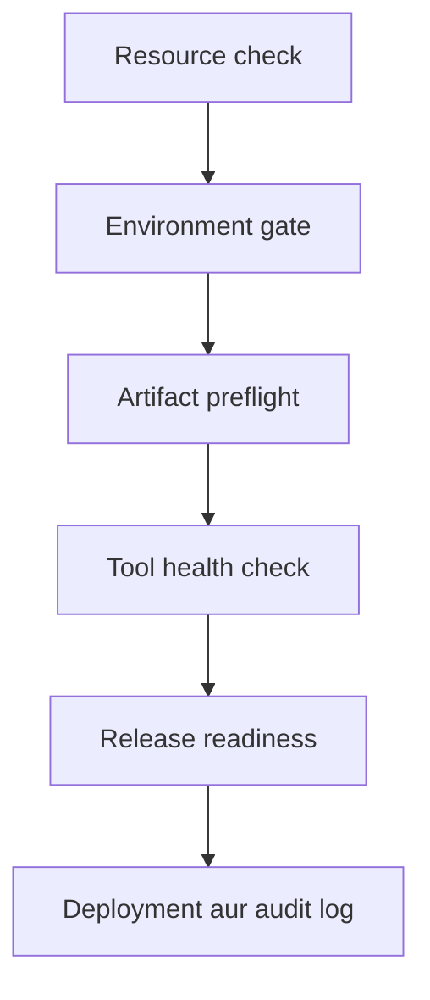

# Bash Conditionals DevOps Lab — Roman Urdu

Yeh beginners ke liye 6 tasks par mushtamil Bash lab hai. Is mein students `if`, `elif`, `else`, `[ ]`, `[[ ]]`, file tests aur exit status istemal karte hue ek real-world jaisa local deployment workflow banayenge.

> Yeh student assignment hai. Is file mein solutions shamil nahin hain.

## Lab ka maqsad

Aisa release workflow banana jo is aham DevOps sawal ka jawab de:

> **Kya yeh application release deployment ke liye safe aur approved hai?**

Students 6 scripts step by step banayenge. Aakhri controller resources, environment approval, release artifact aur required tools check karega. Tamam checks pass hone ke baad hi artifact simulated server par copy hoga aur audit log mein record likha jayega.



Yeh sara kaam local machine par hoga. Real server, cloud account, `sudo` ya production credentials ki zaroorat nahin hai.

## Aap kya seekhenge?

Is lab ko complete karne ke baad students:

- `if`, `elif` aur `else` se decisions lena seekhenge
- `[ condition ]` aur `[[ condition ]]` use karenge
- Numbers aur strings compare karenge
- `-f`, `-r` aur `-s` se files check karenge
- `-z` aur `-n` se empty input check karenge
- `CHG-*` aur `*.tar.gz` jaisay patterns match karenge
- Exit status `0` ko success ke taur par samjhenge
- Chhoti scripts ko jor kar multi-stage workflow banayenge
- Normal output aur error output ko alag rakhenge
- Meaningful exit statuses return karenge
- Local deployment audit log banayenge

## Package ke andar files

```text
conditional-lab/
├── README.md
├── README-Roman-Urdu.md
├── Bash-Conditionals-Lab.md
├── Bash-Conditionals-If-Elif-Else-Beginner-Study-Notes.md
└── bash-conditionals-devops-lab-data/
    ├── README.md
    ├── artifacts/
    │   ├── inventory-api-v1.0.0.tar.gz
    │   └── release.txt
    ├── lab-server/
    │   └── README.md
    ├── logs/
    │   └── README.md
    ├── source/
    │   └── inventory-api-v1.0.0/
    │       ├── VERSION
    │       ├── application.txt
    │       └── config.env
    └── test-data/
        └── deployment-scenarios.csv
```

## Aham documents

| File | Maqsad |
|---|---|
| `Bash-Conditionals-Lab.md` | Mukammal 6-task assignment, tests, deliverables aur marking scheme |
| `Bash-Conditionals-If-Elif-Else-Beginner-Study-Notes.md` | Bash conditionals ke beginner study notes |
| `bash-conditionals-devops-lab-data/README.md` | Diye gaye artifact aur test data ki wazahat |
| `test-data/deployment-scenarios.csv` | Passing aur failing deployment scenarios |

## Chhay connected tasks

| Task | Script | DevOps maqsad |
|---:|---|---|
| 1 | `01-resource-check.sh` | CPU aur disk usage ko `HEALTHY`, `WARNING` ya `CRITICAL` classify karna |
| 2 | `02-environment-gate.sh` | `dev` aur `test` approve karna; `prod` ke liye `CHG-*` ticket lazmi karna |
| 3 | `03-artifact-preflight.sh` | Missing, unreadable, empty ya ghalat naam wala artifact reject karna |
| 4 | `04-tool-health-check.sh` | `command -v` se required command check karna |
| 5 | `05-release-readiness.sh` | Tamam checks mila kar sirf valid release approve karna |
| 6 | `06-deployment-controller.sh` | Approved artifact local server par copy karna aur audit record likhna |

## Zaroori cheezen

- Linux system ya Linux virtual machine
- Bash shell
- Basic commands: `cp`, `mkdir`, `find`, `tar`, `chmod` aur `ls`
- Text editor: Vim, Nano ya VS Code
- Root access ki zaroorat nahin

Bash check karein:

```bash
bash --version
```

## Shuru kaise karein?

Downloaded package extract karke directory mein jayein:

```bash
unzip conditional-lab.zip
cd conditional-lab
```

Pehle study notes aur assignment parhein:

```bash
less Bash-Conditionals-If-Elif-Else-Beginner-Study-Notes.md
less Bash-Conditionals-Lab.md
```

Diye gaye data se apni working directory banayein:

```bash
cp -r bash-conditionals-devops-lab-data bash-conditionals-devops-lab
cd bash-conditionals-devops-lab
```

Assignment complete karte hue isi directory mein chhay scripts banayein.

## Artifact kya hota hai?

Artifact application ka packaged output hota hai jo testing ya deployment ke liye tayyar kiya jata hai. Is lab mein ek chhota fictional Inventory API artifact diya gaya hai:

```text
artifacts/inventory-api-v1.0.0.tar.gz
```

Isay extract kiye baghair inspect karein:

```bash
ls -lh artifacts/
file artifacts/inventory-api-v1.0.0.tar.gz
tar -tzf artifacts/inventory-api-v1.0.0.tar.gz
```

Archive ke andar expected files:

```text
inventory-api-v1.0.0/
inventory-api-v1.0.0/VERSION
inventory-api-v1.0.0/application.txt
inventory-api-v1.0.0/config.env
```

Failure testing ke liye bhi data diya gaya hai:

- `artifacts/release.txt` mojood hai lekin extension ghalat hai.
- `artifacts/missing.tar.gz` jaan boojh kar nonexistent path hai.
- `touch artifacts/empty.tar.gz` se `-s` test ke liye empty artifact banega.

## Conditionals ka quick reference

### Basic structure

```bash
if condition
then
    echo "Condition true hai"
elif another_condition
then
    echo "Doosri condition true hai"
else
    echo "Koi condition true nahin hai"
fi
```

| Keyword | Matlab |
|---|---|
| `if` | Pehli condition check karta hai |
| `then` | True condition ke commands yahan se shuru hote hain |
| `elif` | Pehli condition false ho to doosri condition check karta hai |
| `else` | Jab tamam conditions false hon to yeh block chalta hai |
| `fi` | Conditional block ko band karta hai |

### `[ ]` aur `[[ ]]` mein farq

| Form | Lab mein istemal | Aham baat |
|---|---|---|
| `[ condition ]` | Task 1 mein traditional test | `[` ke baad aur `]` se pehle space lazmi hai |
| `[[ condition ]]` | Tasks 2 aur 3 mein Bash test | Strings aur pattern matching ke liye zyada safe hai |

Variables ko aam tor par double quotes mein rakhein:

```bash
[ "$cpu_usage" -ge 90 ]
[[ "$ticket" == CHG-* ]]
```

`CHG-*` ko quotes mein nahin rakha gaya kyun ke yahan `*` ko pattern ki tarah use karna hai.

### Numeric operators

| Operator | Matlab |
|---|---|
| `-eq` | Barabar |
| `-ne` | Barabar nahin |
| `-gt` | Se bara |
| `-ge` | Bara ya barabar |
| `-lt` | Se chhota |
| `-le` | Chhota ya barabar |

### String aur file tests

| Test | Matlab |
|---|---|
| `-z "$value"` | String empty hai |
| `-n "$value"` | String empty nahin hai |
| `-e "$path"` | Path mojood hai |
| `-f "$path"` | Regular file mojood hai |
| `-d "$path"` | Directory mojood hai |
| `-r "$path"` | Path readable hai |
| `-w "$path"` | Path writable hai |
| `-x "$path"` | Path executable hai |
| `-s "$path"` | File mojood aur empty nahin hai |

## Exit status aur `if`

Bash mein exit status `0` ka matlab success hota hai. `if` is success ko **true** samajhta hai. Koi bhi non-zero status failure hota hai aur `if` isay **false** samajhta hai.

```bash
if command -v tar > /dev/null 2>&1
then
    echo "tar available hai"
else
    echo "tar missing hai" >&2
fi
```

Sab se aakhri command ka exit status foran check karein:

```bash
echo "$?"
```

Yaad rakhein: koi doosri command chalane ke baad `$?` badal jata hai.

## Student scripts validate karein

Har script ka syntax check karein:

```bash
bash -n 01-resource-check.sh
bash -n 02-environment-gate.sh
bash -n 03-artifact-preflight.sh
bash -n 04-tool-health-check.sh
bash -n 05-release-readiness.sh
bash -n 06-deployment-controller.sh
```

Agar koi output na aaye to Bash ko syntax error nahin mila.

Executable permission dein:

```bash
chmod u+x *.sh
ls -l *.sh
```

## Test values

### Healthy development deployment

```text
Application: inventory-api
Environment: dev
Ticket: NONE
Artifact: artifacts/inventory-api-v1.0.0.tar.gz
CPU: 45
Disk: 60
```

Command:

```bash
./06-deployment-controller.sh inventory-api dev NONE artifacts/inventory-api-v1.0.0.tar.gz 45 60
echo "$?"
```

Expected final exit status: `0`.

### Approved production deployment

```bash
./06-deployment-controller.sh inventory-api prod CHG-2026-1001 artifacts/inventory-api-v1.0.0.tar.gz 40 55
echo "$?"
```

Expected final exit status: `0`.

## Lazmi failure tests

Neeche diye gaye har test ko non-zero exit status dena chahiye. Failed test ko kabhi bhi jhoota deployment success message nahin dikhana chahiye.

### Critical CPU usage

```bash
./06-deployment-controller.sh inventory-api dev NONE artifacts/inventory-api-v1.0.0.tar.gz 95 60
echo "$?"
```

### Production approval ke baghair

```bash
./06-deployment-controller.sh inventory-api prod NONE artifacts/inventory-api-v1.0.0.tar.gz 45 60
echo "$?"
```

### Missing artifact

```bash
./06-deployment-controller.sh inventory-api test NONE artifacts/missing.tar.gz 45 60
echo "$?"
```

Mazeed scenarios is file mein hain:

```text
test-data/deployment-scenarios.csv
```

Readable table mein dekhne ke liye:

```bash
column -s, -t test-data/deployment-scenarios.csv
```

Agar `column` available na ho:

```bash
cat test-data/deployment-scenarios.csv
```

## Deployment results verify karein

Successful development aur production tests ke baad simulated server inspect karein:

```bash
find lab-server -type f
ls -lh lab-server/dev/inventory-api/
ls -lh lab-server/prod/inventory-api/
```

Expected deployed artifacts:

```text
lab-server/dev/inventory-api/inventory-api-v1.0.0.tar.gz
lab-server/prod/inventory-api/inventory-api-v1.0.0.tar.gz
```

Audit log dekhein:

```bash
cat logs/deployment-audit.log
```

Controller ko purane records overwrite nahin karne chahiye. `>>` istemal karke har naya record append hona chahiye. Har final record mein date/time, user, application, environment, ticket, artifact, CPU, disk aur status hona chahiye.

## Final student deliverables

```text
bash-conditionals-devops-lab/
├── README.md
├── 01-resource-check.sh
├── 02-environment-gate.sh
├── 03-artifact-preflight.sh
├── 04-tool-health-check.sh
├── 05-release-readiness.sh
├── 06-deployment-controller.sh
├── artifacts/
│   └── inventory-api-v1.0.0.tar.gz
├── lab-server/
│   ├── dev/inventory-api/inventory-api-v1.0.0.tar.gz
│   └── prod/inventory-api/inventory-api-v1.0.0.tar.gz
├── logs/
│   └── deployment-audit.log
└── source/
```

Student ki final `README.md` mein yeh cheezen honi chahiye:

- Lab ka objective
- `if`, `elif`, `else` aur `fi` ka matlab
- `[ ]` aur `[[ ]]` ka farq
- Numeric operators ki table
- File tests ki table
- Exit status `0` ki explanation
- Ek successful workflow ka result
- Teen failed workflows ke results
- Final learning summary

## Beginner boundaries

Sirf woh concepts use karein jo lab mein cover hue hain:

- Shebang aur comments
- `echo`
- Variables aur positional arguments
- `if`, `elif` aur `else`
- `[ ]` aur `[[ ]]`
- `&&`, `||` aur `!`
- Basic Linux commands
- Redirection aur `exit`

Functions, loops, arrays, `case`, `getopts`, `sudo`, remote servers aur production resources use na karein.

## Completion checklist

- [ ] Tamam chhay scripts ki pehli line `#!/bin/bash` hai.
- [ ] Variables aur positional arguments properly quoted hain.
- [ ] Ghalat argument count par usage message nazar aata hai.
- [ ] Error messages clear hain aur zaroorat par standard error use karte hain.
- [ ] `bash -n` koi syntax error nahin dikhata.
- [ ] Healthy development deployment successful hai.
- [ ] Approved production deployment successful hai.
- [ ] Kam az kam teen failure scenarios non-zero status return karte hain.
- [ ] Failed readiness par artifact copy nahin hota.
- [ ] Successful files sirf `lab-server/` ke andar jati hain.
- [ ] Audit log purane records ko preserve karta hai.
- [ ] Student README results aur learning explain karti hai.

## Marking scheme

| Requirement | Marks |
|---|---:|
| Resource thresholds ki sahi classification | 15 |
| Environment approval gate | 15 |
| Artifact preflight validation | 15 |
| Tool command aur exit-status check | 10 |
| Combined release-readiness gate | 20 |
| Safe deployment aur audit logging | 20 |
| Syntax, comments, quoting, permissions aur README | 5 |
| **Total** | **100** |

## Safety note

Is lab ke tamam applications, tickets, artifacts aur server paths fictional hain. Har copied file ko `lab-server/` ke andar rakhein. Is beginner exercise mein `sudo`, real credentials, remote hosts ya production paths kabhi add na karein.

---

Tasks ko order mein complete karein. Har script final deployment workflow ka ek safety gate banegi.
