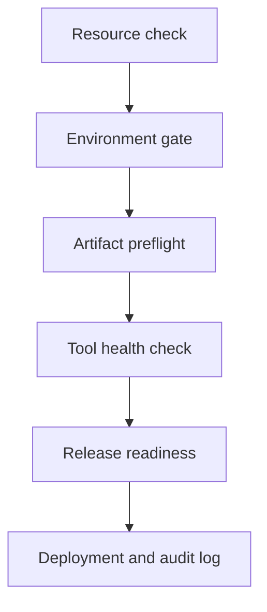

# Bash Conditionals DevOps Lab

A beginner-friendly, six-task Bash lab that teaches `if`, `elif`, `else`, `[ ]`, `[[ ]]`, file tests, command exit statuses, and safe decision-making through a realistic local deployment workflow.

> This is a student assignment. Solutions are intentionally not included.

## Lab objective

Build a release workflow that answers one important DevOps question:

> **Is this application release safe and approved for deployment?**

Students gradually create six connected scripts. The final controller checks resources, environment approval, release artifacts, and required tools before copying an approved package to a simulated server and writing an audit record.



Everything runs locally. No real server, cloud account, `sudo`, or production credential is required.

## Learning outcomes

By completing this lab, students will practise:

- Writing `if`, `elif`, and `else` decisions
- Using traditional `[ condition ]` and Bash `[[ condition ]]`
- Comparing numbers and strings
- Testing files with `-f`, `-r`, and `-s`
- Checking empty input with `-z` and `-n`
- Matching patterns such as `CHG-*` and `*.tar.gz`
- Treating command exit status `0` as success
- Combining scripts into a multi-stage workflow
- Separating normal output from errors
- Returning meaningful exit statuses
- Creating a local deployment audit log

## Package contents

```text
conditional-lab/
├── README.md
├── Bash-Conditionals-Lab.md
├── Bash-Conditionals-If-Elif-Else-Beginner-Study-Notes.md
└── bash-conditionals-devops-lab-data/
    ├── README.md
    ├── artifacts/
    │   ├── inventory-api-v1.0.0.tar.gz
    │   └── release.txt
    ├── lab-server/
    │   └── README.md
    ├── logs/
    │   └── README.md
    ├── source/
    │   └── inventory-api-v1.0.0/
    │       ├── VERSION
    │       ├── application.txt
    │       └── config.env
    └── test-data/
        └── deployment-scenarios.csv
```

## Main documents

| File | Purpose |
|---|---|
| `Bash-Conditionals-Lab.md` | Complete six-task student assignment, tests, deliverables, and marking scheme |
| `Bash-Conditionals-If-Elif-Else-Beginner-Study-Notes.md` | Beginner study notes for Bash conditionals |
| `bash-conditionals-devops-lab-data/README.md` | Explanation of the supplied artifact and test data |
| `test-data/deployment-scenarios.csv` | Ready-made passing and failing deployment scenarios |

## Six connected tasks

| Task | Script | DevOps purpose |
|---:|---|---|
| 1 | `01-resource-check.sh` | Classify CPU and disk usage as `HEALTHY`, `WARNING`, or `CRITICAL` |
| 2 | `02-environment-gate.sh` | Approve `dev` and `test`; require a `CHG-*` ticket for `prod` |
| 3 | `03-artifact-preflight.sh` | Reject missing, unreadable, empty, or incorrectly named artifacts |
| 4 | `04-tool-health-check.sh` | Confirm a required command exists with `command -v` |
| 5 | `05-release-readiness.sh` | Combine all checks and approve only a fully valid release |
| 6 | `06-deployment-controller.sh` | Copy an approved artifact locally and append an audit record |

## Prerequisites

- A Linux system or Linux virtual machine
- Bash
- Basic commands such as `cp`, `mkdir`, `find`, `tar`, `chmod`, and `ls`
- A text editor such as Vim, Nano, or VS Code
- No root access is needed

Confirm Bash is available:

```bash
bash --version
```

## Quick start

Extract the downloaded package and enter it:

```bash
unzip conditional-lab.zip
cd conditional-lab
```

Read the study notes and assignment:

```bash
less Bash-Conditionals-If-Elif-Else-Beginner-Study-Notes.md
less Bash-Conditionals-Lab.md
```

Create a working directory from the supplied data:

```bash
cp -r bash-conditionals-devops-lab-data bash-conditionals-devops-lab
cd bash-conditionals-devops-lab
```

Create all six scripts in this directory as you progress through the assignment.

## Understand the supplied artifact

An **artifact** is a packaged application output prepared for testing or deployment. This lab supplies a small, fictional Inventory API artifact:

```text
artifacts/inventory-api-v1.0.0.tar.gz
```

Inspect it without extracting it:

```bash
ls -lh artifacts/
file artifacts/inventory-api-v1.0.0.tar.gz
tar -tzf artifacts/inventory-api-v1.0.0.tar.gz
```

Expected archive contents:

```text
inventory-api-v1.0.0/
inventory-api-v1.0.0/VERSION
inventory-api-v1.0.0/application.txt
inventory-api-v1.0.0/config.env
```

The package also provides intentional failure data:

- `artifacts/release.txt` exists but has the wrong extension.
- `artifacts/missing.tar.gz` is an intentionally nonexistent path.
- `touch artifacts/empty.tar.gz` creates an empty artifact for testing `-s`.

## Conditionals quick reference

### Basic structure

```bash
if condition
then
    echo "Condition is true"
elif another_condition
then
    echo "Another condition is true"
else
    echo "No condition is true"
fi
```

| Keyword | Meaning |
|---|---|
| `if` | Starts the first test |
| `then` | Starts the commands for a true condition |
| `elif` | Tests another condition when earlier tests are false |
| `else` | Runs when all earlier conditions are false |
| `fi` | Ends the conditional block |

### `[ ]` compared with `[[ ]]`

| Form | Use in this lab | Important note |
|---|---|---|
| `[ condition ]` | Traditional test syntax in Task 1 | Spaces after `[` and before `]` are required |
| `[[ condition ]]` | Bash condition syntax in Tasks 2 and 3 | Safer string handling and pattern matching |

Quote variables unless intentionally using a pattern:

```bash
[ "$cpu_usage" -ge 90 ]
[[ "$ticket" == CHG-* ]]
```

### Numeric operators

| Operator | Meaning |
|---|---|
| `-eq` | Equal |
| `-ne` | Not equal |
| `-gt` | Greater than |
| `-ge` | Greater than or equal |
| `-lt` | Less than |
| `-le` | Less than or equal |

### Useful string and file tests

| Test | Meaning |
|---|---|
| `-z "$value"` | String is empty |
| `-n "$value"` | String is not empty |
| `-e "$path"` | Path exists |
| `-f "$path"` | Regular file exists |
| `-d "$path"` | Directory exists |
| `-r "$path"` | Path is readable |
| `-w "$path"` | Path is writable |
| `-x "$path"` | Path is executable |
| `-s "$path"` | File exists and is not empty |

## Exit status and `if`

In Bash, exit status `0` means success and is treated as **true** by `if`. Any non-zero status means failure and is treated as **false**.

```bash
if command -v tar > /dev/null 2>&1
then
    echo "tar is available"
else
    echo "tar is missing" >&2
fi
```

Check the most recent exit status immediately:

```bash
echo "$?"
```

## Validate student scripts

Check all script syntax:

```bash
bash -n 01-resource-check.sh
bash -n 02-environment-gate.sh
bash -n 03-artifact-preflight.sh
bash -n 04-tool-health-check.sh
bash -n 05-release-readiness.sh
bash -n 06-deployment-controller.sh
```

No output means Bash found no syntax errors.

Add executable permission:

```bash
chmod u+x *.sh
ls -l *.sh
```

## Test values

### Healthy development deployment

```text
Application: inventory-api
Environment: dev
Ticket: NONE
Artifact: artifacts/inventory-api-v1.0.0.tar.gz
CPU: 45
Disk: 60
```

Run it:

```bash
./06-deployment-controller.sh inventory-api dev NONE artifacts/inventory-api-v1.0.0.tar.gz 45 60
echo "$?"
```

Expected final exit status: `0`.

### Approved production deployment

```bash
./06-deployment-controller.sh inventory-api prod CHG-2026-1001 artifacts/inventory-api-v1.0.0.tar.gz 40 55
echo "$?"
```

Expected final exit status: `0`.

## Required failure tests

Every command below should return a non-zero status and must not show a false success message.

### Critical CPU usage

```bash
./06-deployment-controller.sh inventory-api dev NONE artifacts/inventory-api-v1.0.0.tar.gz 95 60
echo "$?"
```

### Production without approval

```bash
./06-deployment-controller.sh inventory-api prod NONE artifacts/inventory-api-v1.0.0.tar.gz 45 60
echo "$?"
```

### Missing artifact

```bash
./06-deployment-controller.sh inventory-api test NONE artifacts/missing.tar.gz 45 60
echo "$?"
```

Additional scenarios are available in:

```text
test-data/deployment-scenarios.csv
```

Display them with:

```bash
column -s, -t test-data/deployment-scenarios.csv
```

If `column` is unavailable:

```bash
cat test-data/deployment-scenarios.csv
```

## Verify deployment results

After successful development and production tests, inspect the simulated server:

```bash
find lab-server -type f
ls -lh lab-server/dev/inventory-api/
ls -lh lab-server/prod/inventory-api/
```

Expected deployed artifacts:

```text
lab-server/dev/inventory-api/inventory-api-v1.0.0.tar.gz
lab-server/prod/inventory-api/inventory-api-v1.0.0.tar.gz
```

Inspect the audit log:

```bash
cat logs/deployment-audit.log
```

The controller should append records instead of overwriting old ones. Each final record should include the date and time, user, application, environment, ticket, artifact, CPU, disk, and status.

## Final student deliverables

```text
bash-conditionals-devops-lab/
├── README.md
├── 01-resource-check.sh
├── 02-environment-gate.sh
├── 03-artifact-preflight.sh
├── 04-tool-health-check.sh
├── 05-release-readiness.sh
├── 06-deployment-controller.sh
├── artifacts/
│   └── inventory-api-v1.0.0.tar.gz
├── lab-server/
│   ├── dev/inventory-api/inventory-api-v1.0.0.tar.gz
│   └── prod/inventory-api/inventory-api-v1.0.0.tar.gz
├── logs/
│   └── deployment-audit.log
└── source/
```

## Beginner boundaries

Use only concepts covered in the lab:

- Shebang and comments
- `echo`
- Variables and positional arguments
- `if`, `elif`, and `else`
- `[ ]` and `[[ ]]`
- `&&`, `||`, and `!`
- Basic Linux commands
- Redirection and `exit`

Do not use functions, loops, arrays, `case`, `getopts`, `sudo`, remote servers, or production resources.

## Completion checklist

- [ ] All six scripts have `#!/bin/bash` as the first line.
- [ ] Variables and positional arguments are quoted.
- [ ] Incorrect argument counts display usage information.
- [ ] Error messages are clear and use standard error where appropriate.
- [ ] `bash -n` reports no syntax errors.
- [ ] Healthy development deployment succeeds.
- [ ] Approved production deployment succeeds.
- [ ] At least three failure scenarios return non-zero statuses.
- [ ] Failed readiness never copies an artifact.
- [ ] Successful deployments appear only inside `lab-server/`.
- [ ] The audit log preserves earlier records.
- [ ] The student README explains the results and learning.

## Marking scheme

| Requirement | Marks |
|---|---:|
| Resource threshold classification | 15 |
| Environment approval gate | 15 |
| Artifact preflight validation | 15 |
| Tool command and exit-status check | 10 |
| Combined release-readiness gate | 20 |
| Safe deployment and audit logging | 20 |
| Syntax, comments, quoting, permissions, and README | 5 |
| **Total** | **100** |

## Safety note

All applications, tickets, artifacts, and server paths in this lab are fictional. Keep every copied file inside `lab-server/`. Never add `sudo`, real credentials, remote hosts, or production paths to this beginner exercise.

---

Complete the tasks in order: each script becomes one gate in the final deployment workflow.
