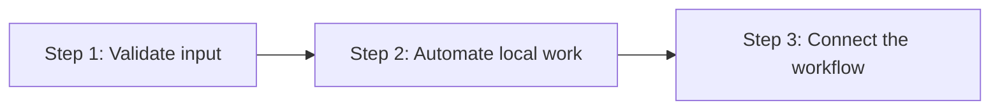
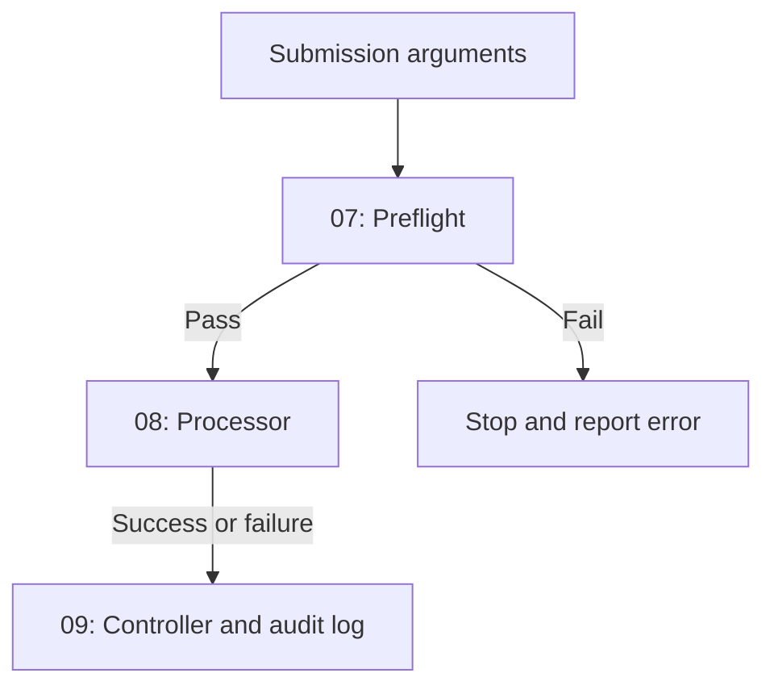

# Bash Scripting Level 2 — Guided Automation

A beginner-plus Bash package that moves students from isolated foundation scripts to safe, connected local automation.

Level 2 increases difficulty in three controlled steps:



Students first combine arguments with conditions, then add exit statuses, command chaining, copying, and logs, and finally build a complete student-submission processor.

## Correct learning order

```text
Assignment -> Student scripts -> Testing -> Solution review -> MCQ quiz
```

Students should not open the solution before attempting the lab.

## Package contents

```text
level-2/
├── README.md
├── Level-2-Guided-Automation-Lab.md
├── Bash-Scripting-Level-2-MCQ-Quiz.html
└── Bash-Level-2-Solution/
    ├── README.md
    ├── 01-user-role.sh
    ├── 02-argument-check.sh
    ├── 03-homework-validator.sh
    ├── 04-workspace-setup.sh
    ├── 05-homework-copy.sh
    ├── 06-backup-with-log.sh
    ├── 07-submission-preflight.sh
    ├── 08-submission-processor.sh
    ├── 09-submission-controller.sh
    └── data/
        ├── homework-ali.txt
        ├── homework-sara.txt
        └── empty-homework.txt
```

## Main files

| File | Purpose |
|---|---|
| [`Level-2-Guided-Automation-Lab.md`](./Level-2-Guided-Automation-Lab.md) | Complete nine-task student assignment |
| [`Bash-Level-2-Solution/README.md`](./Bash-Level-2-Solution/README.md) | Tested solution guide, explanations, and commands |
| [`Bash-Scripting-Level-2-MCQ-Quiz.html`](./Bash-Scripting-Level-2-MCQ-Quiz.html) | Interactive 25-question assessment |

## Learning objectives

After completing Level 2, students should be able to:

- Validate argument counts with `$#`
- Display useful usage messages
- Return meaningful success and failure exit statuses
- Check the previous status with `$?`
- Test regular, non-empty, and empty values
- Use `-f`, `-s`, and `-z`
- Reverse a condition with `!`
- Use `&&` for success chaining
- Use `||` for failure handling
- Create directory trees with `mkdir -p`
- Copy local files safely with `cp`
- Extract filenames with `basename`
- Generate timestamps with `date`
- Quote paths and arguments correctly
- Create backup filenames containing timestamps
- Append log records with `>>`
- Run one script from another
- Use a script exit status as an `if` condition
- Build preflight, processing, and controller stages
- Record successful and failed attempts in an audit log

## Three-step lab structure

### Step 1 — Combine Two Concepts

| Task | Script | Main skill |
|---:|---|---|
| 1 | `01-user-role.sh` | Arguments with string conditions |
| 2 | `02-argument-check.sh` | Argument-count validation and exit statuses |
| 3 | `03-homework-validator.sh` | Regular-file and non-empty-file checks |

### Step 2 — Small Local Automation

| Task | Script | Main skill |
|---:|---|---|
| 4 | `04-workspace-setup.sh` | Directory creation and `&&` |
| 5 | `05-homework-copy.sh` | Local copying and `||` failure handling |
| 6 | `06-backup-with-log.sh` | Timestamped backup and append-only log |

### Step 3 — Connected Student-Submission Project

| Task | Script | Main skill |
|---:|---|---|
| 7 | `07-submission-preflight.sh` | Validate student name and homework file |
| 8 | `08-submission-processor.sh` | Process only an approved submission |
| 9 | `09-submission-controller.sh` | Control the flow and create an audit log |

## Connected project flow



## Prerequisites

- Completion of Bash Scripting Level 1
- Linux, WSL, or a Linux virtual machine
- Bash shell
- A text editor such as Vim, Nano, or VS Code
- Understanding of variables, arguments, and basic conditionals

No `sudo`, cloud account, or remote server is required.

## Getting started

Extract and enter the package:

```bash
unzip level-2.zip
cd level-2
```

Open the assignment:

```bash
less Level-2-Guided-Automation-Lab.md
```

Create a separate student workspace:

```bash
mkdir -p student-work/data
cd student-work
```

Create the two sample files:

```bash
echo "Ali: Bash arguments practice" > data/homework-ali.txt
echo "Sara: Bash conditionals practice" > data/homework-sara.txt
touch data/empty-homework.txt
```

Write the nine scripts in this directory while completing the assignment.

## Student workflow

### 1. Complete each task in order

Do not begin the connected project until Tasks 1-6 work correctly.

### 2. Check syntax frequently

```bash
bash -n *.sh
```

No output means Bash found no syntax errors.

### 3. Add executable permission

```bash
chmod u+x *.sh
```

### 4. Check exit statuses immediately

```bash
./02-argument-check.sh inventory-api dev
echo "$?"
```

Run `echo "$?"` immediately because the next command replaces the previous status.

### 5. Test both successful and failed paths

Required failure examples include:

- Incorrect argument count
- Missing file
- Empty file
- Invalid student name containing `/`

### 6. Review the solution only after testing

```bash
cd ..
less Bash-Level-2-Solution/README.md
```

### 7. Complete the MCQ assessment

Open:

```text
Bash-Scripting-Level-2-MCQ-Quiz.html
```

## Run the supplied solution

```bash
cd Bash-Level-2-Solution
chmod u+x *.sh
bash -n *.sh
```

Run the three stages:

```bash
./01-user-role.sh Ali student
./02-argument-check.sh inventory-api dev
./03-homework-validator.sh data/homework-ali.txt

./04-workspace-setup.sh bash-101
./05-homework-copy.sh data/homework-ali.txt classroom/bash-101/incoming
./06-backup-with-log.sh data/homework-ali.txt backups

./07-submission-preflight.sh Ali data/homework-ali.txt
./08-submission-processor.sh Ali data/homework-ali.txt classroom/bash-101
./09-submission-controller.sh Ali data/homework-ali.txt classroom/bash-101
```

## Verify generated results

```bash
find classroom -type f
find backups -type f
cat logs/backup.log
cat classroom/bash-101/submission-audit.log
```

## Interactive quiz features

- 25 Level 2 multiple-choice questions
- 25-minute timer
- 80% passing score
- Progress bar
- Unanswered-question warning
- Automatic submission when time expires
- Correct and incorrect answer highlighting
- Short explanation for every question
- Attempt counter and time-used report
- Browser best-score tracking
- Shuffled questions and choices on every reattempt

## Open the quiz locally

On Linux with a graphical browser:

```bash
xdg-open Bash-Scripting-Level-2-MCQ-Quiz.html
```

On Windows or WSL, open the `level-2` folder and double-click the HTML file.

## GitHub Pages quiz

After publishing the repository with GitHub Pages, a typical quiz URL will look like:

```text
https://USERNAME.github.io/shell-scripting/level-2/Bash-Scripting-Level-2-MCQ-Quiz.html
```

Replace `USERNAME` and confirm the repository's GitHub Pages settings.

## Recommended teaching schedule

| Lesson | Work |
|---|---|
| 1 | Tasks 1-3: combined basics and validation |
| 2 | Tasks 4-5: directories and copying |
| 3 | Task 6: timestamped backup and logging |
| 4 | Task 7: preflight validation |
| 5 | Tasks 8-9: processing and controller flow |
| Assessment | Project demonstration and 25-question quiz |

For each task:

1. Review the Level 1 concept being reused.
2. Introduce only one new Level 2 behavior.
3. Run a success test.
4. Run a failure test.
5. Check `$?` immediately.
6. Ask students to explain why processing continued or stopped.

## Student submission

```text
student-work/
├── README.md
├── 01-user-role.sh
├── 02-argument-check.sh
├── 03-homework-validator.sh
├── 04-workspace-setup.sh
├── 05-homework-copy.sh
├── 06-backup-with-log.sh
├── 07-submission-preflight.sh
├── 08-submission-processor.sh
├── 09-submission-controller.sh
├── data/
├── backups/
├── logs/
└── classroom/
```

## Completion checklist

- [ ] All nine scripts start with `#!/bin/bash`.
- [ ] Argument counts are validated before arguments are used.
- [ ] Usage and failure messages go to standard error.
- [ ] Successful scripts return `0`.
- [ ] Failed checks return a non-zero status.
- [ ] Paths and variable expansions are quoted.
- [ ] Missing and empty files are rejected.
- [ ] `&&` and `||` are used correctly.
- [ ] Backup and audit logs preserve old records.
- [ ] Failed preflight does not copy a submission.
- [ ] `bash -n *.sh` reports no syntax errors.
- [ ] At least three failure paths were demonstrated.
- [ ] The MCQ score is at least 80%.

## What comes after Level 2?

Level 3 can introduce:

- `for` and `while` loops
- Repeated processing
- Counters
- `break` and `continue`
- Functions and parameters
- Local variables
- Reusable validation

These topics should begin only after students can explain the Level 2 flow without reading the solution.

## Safety

All users, homework files, class directories, backups, and logs are fictional local practice data. Do not add `sudo`, real student information, remote systems, cloud resources, or production paths.

---

Validate first, process second, and always record the final result.
