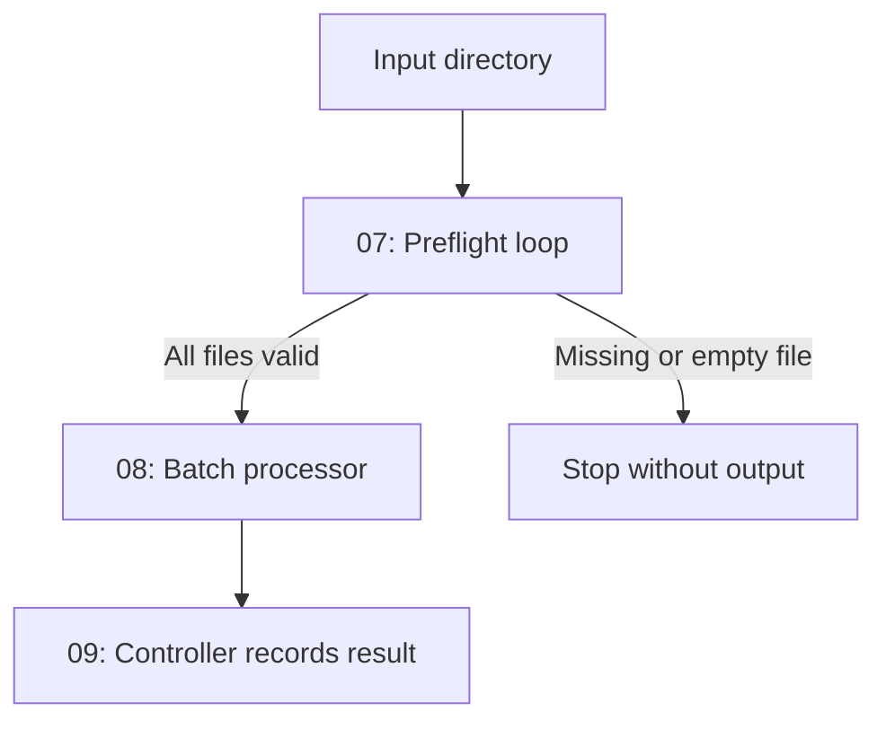

# Bash Scripting Level 3 — Loops and Batch Processing

A guided Bash package that teaches students how to repeat work safely, read files line by line, control loop flow, count results, and process a local batch of files.

Level 3 grows in three controlled steps:


Students begin with fruits and simple counters. They then read student names, skip blank lines, stop a search when a match is found, and finish with a connected homework batch processor.

## Correct learning order

```text
Assignment -> Student scripts -> Testing -> Solution review -> MCQ quiz
```

Students should attempt the assignment before opening the solution.

## Package contents

```text
level-3/
├── README.md
├── Level-3-Loops-and-Batch-Processing-Lab.md
├── Bash-Scripting-Level-3-MCQ-Quiz.html
└── Bash-Level-3-Solution/
    ├── README.md
    ├── 01-for-fruits.sh
    ├── 02-while-counter.sh
    ├── 03-read-students.sh
    ├── 04-skip-empty-lines.sh
    ├── 05-find-student.sh
    ├── 06-homework-report.sh
    ├── 07-batch-preflight.sh
    ├── 08-batch-processor.sh
    ├── 09-batch-controller.sh
    └── data/
        ├── students.txt
        ├── students-with-blanks.txt
        ├── valid/
        │   ├── homework-ali.txt
        │   ├── homework-sara.txt
        │   └── homework-omar.txt
        └── mixed/
            ├── homework-ali.txt
            └── homework-empty.txt
```

## Main files

| File | Purpose |
|---|---|
| [`Level-3-Loops-and-Batch-Processing-Lab.md`](./Level-3-Loops-and-Batch-Processing-Lab.md) | Complete nine-task student assignment |
| [`Bash-Level-3-Solution/README.md`](./Bash-Level-3-Solution/README.md) | Tested solutions, explanations, and run commands |
| [`Bash-Scripting-Level-3-MCQ-Quiz.html`](./Bash-Scripting-Level-3-MCQ-Quiz.html) | Interactive 25-question assessment |

## Learning objectives

After completing Level 3, students should be able to:

- Repeat commands with a `for` loop
- Process all command-line arguments with `"$@"`
- Repeat while a condition is true
- Create and update numeric counters
- Avoid an accidental infinite loop
- Read a text file with `while IFS= read -r`
- Feed a file into a loop with input redirection
- Detect blank lines with `-z`
- Skip one iteration with `continue`
- Stop a loop with `break`
- Use a simple flag to remember a search result
- Validate a directory with `-d`
- Match local text files with `*.txt`
- Quote the directory portion of a wildcard path
- Handle a wildcard that matched no files
- Extract a filename with `basename`
- Count total, valid, and empty files
- Validate a complete batch before processing it
- Prevent output creation when preflight fails
- Run one script from another
- Record success and failure in an audit log

## Three-step lab structure

### Step 1 — Loop Foundations

| Task | Script | Main skill |
|---:|---|---|
| 1 | `01-for-fruits.sh` | `for`, `"$@"`, and fruit arguments |
| 2 | `02-while-counter.sh` | `while`, numeric comparison, and a counter |
| 3 | `03-read-students.sh` | Safe line-by-line file reading |

### Step 2 — Control the Loop

| Task | Script | Main skill |
|---:|---|---|
| 4 | `04-skip-empty-lines.sh` | `continue` and blank-line filtering |
| 5 | `05-find-student.sh` | Search flag, `break`, and exit status |
| 6 | `06-homework-report.sh` | Wildcards and result counters |

### Step 3 — Connected Batch Project

| Task | Script | Main skill |
|---:|---|---|
| 7 | `07-batch-preflight.sh` | Validate every homework file |
| 8 | `08-batch-processor.sh` | Process only an approved batch |
| 9 | `09-batch-controller.sh` | Control the workflow and append an audit log |

## Connected project flow



## Prerequisites

- Completion of Bash Scripting Levels 1 and 2
- Linux, WSL, or a Linux virtual machine
- Bash shell
- A text editor such as Vim, Nano, or VS Code
- Basic knowledge of variables, arguments, conditionals, file tests, and exit statuses

No `sudo`, cloud account, remote server, function, or array is required.

## Getting started

Extract and enter the package:

```bash
unzip Bash-Scripting-Level-3-Package.zip
cd level-3
```

Open the assignment:

```bash
less Level-3-Loops-and-Batch-Processing-Lab.md
```

Create a separate student workspace:

```bash
mkdir -p student-work/data/valid student-work/data/mixed
cd student-work
```

Create the student-name files:

```bash
echo "Ali" > data/students.txt
echo "Sara" >> data/students.txt
echo "Omar" >> data/students.txt

echo "Ali" > data/students-with-blanks.txt
echo "" >> data/students-with-blanks.txt
echo "Sara" >> data/students-with-blanks.txt
echo "" >> data/students-with-blanks.txt
echo "Omar" >> data/students-with-blanks.txt
```

Create a valid homework batch:

```bash
echo "Ali: Bash loop practice" > data/valid/homework-ali.txt
echo "Sara: Bash loop practice" > data/valid/homework-sara.txt
echo "Omar: Bash loop practice" > data/valid/homework-omar.txt
```

Create a mixed batch containing one empty file:

```bash
echo "Ali: Complete homework" > data/mixed/homework-ali.txt
touch data/mixed/homework-empty.txt
```

Write the nine scripts in `student-work` while completing the assignment.

## Student workflow

### 1. Complete each task in order

Do not begin the connected batch project until Tasks 1-6 work correctly.

### 2. Check syntax frequently

```bash
bash -n *.sh
```

No output means Bash found no syntax errors.

### 3. Add executable permission

```bash
chmod u+x *.sh
```

### 4. Test successful and failed paths

Examples:

```bash
./01-for-fruits.sh apple banana cherry
./01-for-fruits.sh

./05-find-student.sh Sara data/students.txt
./05-find-student.sh Ahmed data/students.txt

./07-batch-preflight.sh data/valid
./07-batch-preflight.sh data/mixed
```

### 5. Check exit statuses immediately

```bash
./07-batch-preflight.sh data/mixed
echo "$?"
```

Run `echo "$?"` immediately because the next command replaces the previous status.

### 6. Watch counter values

Before running a loop, predict the final value of each counter. Then compare your prediction with the script output.

### 7. Review the solution only after testing

```bash
cd ..
less Bash-Level-3-Solution/README.md
```

### 8. Complete the MCQ assessment

Open:

```text
Bash-Scripting-Level-3-MCQ-Quiz.html
```

## Run the supplied solution

```bash
cd Bash-Level-3-Solution
chmod u+x *.sh
bash -n *.sh
```

Run Step 1:

```bash
./01-for-fruits.sh apple banana cherry
./02-while-counter.sh
./03-read-students.sh data/students.txt
```

Run Step 2:

```bash
./04-skip-empty-lines.sh data/students-with-blanks.txt
./05-find-student.sh Sara data/students.txt
./06-homework-report.sh data/valid
./06-homework-report.sh data/mixed
```

Run Step 3:

```bash
./07-batch-preflight.sh data/valid
./08-batch-processor.sh data/valid processed-homework
./09-batch-controller.sh data/valid final-homework
```

Test the rejected batch:

```bash
./07-batch-preflight.sh data/mixed
./09-batch-controller.sh data/mixed rejected-output
```

The second controller command should fail, and `rejected-output` should not be created.

## Verify generated results

```bash
find processed-homework -type f
find final-homework -type f
cat logs/batch-audit.log
```

Expected valid output:

- Three homework files in `processed-homework`
- Three homework files in `final-homework`
- A `SUCCESS` entry for the valid batch
- A `FAILED` entry after testing the mixed batch

## Interactive quiz features

- 25 Level 3 multiple-choice questions
- 25-minute timer
- 80% passing score
- Progress bar
- Unanswered-question warning
- Automatic submission when time expires
- Correct and incorrect answer highlighting
- Short explanation for every answer
- Attempt counter and time-used report
- Browser best-score tracking
- Shuffled questions and choices on every reattempt
- Print-friendly and mobile-friendly layout

## Open the quiz locally

On Linux with a graphical browser:

```bash
xdg-open Bash-Scripting-Level-3-MCQ-Quiz.html
```

On Windows or WSL, open the `level-3` folder and double-click the HTML file.

## GitHub Pages quiz

After publishing the repository with GitHub Pages, a typical quiz URL will look like:

```text
https://USERNAME.github.io/shell-scripting/level-3/Bash-Scripting-Level-3-MCQ-Quiz.html
```

Replace `USERNAME` and confirm the repository's GitHub Pages settings.

## Recommended teaching schedule

| Lesson | Work |
|---|---|
| 1 | Task 1: `for` loops using apple, banana, and cherry |
| 2 | Tasks 2-3: `while`, counters, and reading files |
| 3 | Tasks 4-5: `continue`, `break`, and search results |
| 4 | Task 6: wildcards and summary counters |
| 5 | Task 7: full-batch preflight |
| 6 | Tasks 8-9: processor, controller, and audit log |
| Assessment | Batch demonstration and 25-question quiz |

For every task:

1. Ask students to predict how many iterations will run.
2. Trace one iteration together.
3. Run a successful example.
4. Run a failed or empty example.
5. Check `$?` immediately.
6. Ask why the loop continued, skipped, or stopped.

## Student submission

```text
student-work/
├── README.md
├── 01-for-fruits.sh
├── 02-while-counter.sh
├── 03-read-students.sh
├── 04-skip-empty-lines.sh
├── 05-find-student.sh
├── 06-homework-report.sh
├── 07-batch-preflight.sh
├── 08-batch-processor.sh
├── 09-batch-controller.sh
├── data/
├── processed-homework/
├── final-homework/
└── logs/
```

## Completion checklist

- [ ] All nine scripts start with `#!/bin/bash`.
- [ ] Every loop is closed with `done`.
- [ ] `"$@"` is quoted when processing all arguments.
- [ ] The `while` counter changes during every iteration.
- [ ] Text files are read with `IFS= read -r`.
- [ ] Blank lines are skipped with `continue`.
- [ ] The student search stops with `break`.
- [ ] Paths and variable expansions are quoted.
- [ ] Directory arguments are checked with `-d`.
- [ ] Empty homework files are rejected with `-s`.
- [ ] The no-match wildcard case is handled.
- [ ] Failed preflight creates no processed output.
- [ ] The audit log keeps both successful and failed records.
- [ ] `bash -n *.sh` reports no syntax errors.
- [ ] The MCQ score is at least 80%.

## What comes after Level 3?

Level 4 can introduce:

- Functions and parameters
- Reusable validation
- Local variables
- Return statuses from functions
- Breaking one large script into small reusable parts

Functions are intentionally excluded from Level 3 so students can first understand loop flow and batch processing clearly.

## Safety

All students, homework files, directories, and logs are fictional local practice data. Do not add `sudo`, real student information, remote systems, cloud resources, or production paths.

---

Repeat carefully, validate the complete batch, process only approved input, and record the final result.
